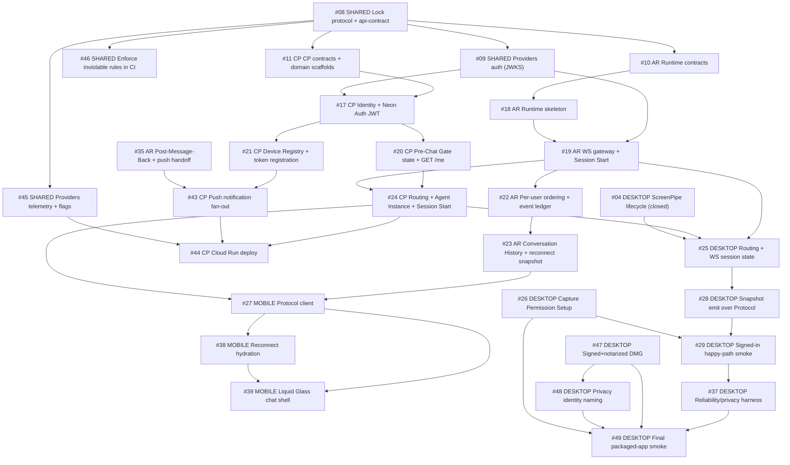

# Mission Control

## Operating Frame

- Date: 2026-05-28
- Repo: `/Users/srujanu/Desktop/Hey Intentive`
- Tracker root: `.scratch/v1-backlog/` (unified — 50 issues globally numbered 01–50)
- Closed: `#01`–`#09` (Desktop v1 foundation + shared protocol/api-contract lock + Providers JWKS auth, shipped)
- Open: `#10`–`#50`

## Executive Next Move

Two shared roots are now landed (`#08` protocol/api-contract lock, `#09` Providers JWKS auth). The lane roots are unblocked: run [#10 AR — Resolve Runtime Contracts](.scratch/v1-backlog/issues/10-AR-resolve-runtime-contracts-before-code.md) and [#11 CP — Contracts + Domain Scaffolds](.scratch/v1-backlog/issues/11-CP-resolve-control-plane-contracts-and-domain-scaffolds.md) (both depend only on `#08`). Mobile foundation lane `#12`–`#16` can also start now. `#17` (CP Identity) and `#19` (AR WS gateway) now have their hard auth blocker (`#09`) cleared and consume `createJwtVerifier` from `@intentive/providers/auth`.

What it unlocks:
- `#09` (Providers auth) → `#45` (telemetry/flags) → `#46` (CI rule enforcement).
- `#10` → `#18` → `#19` → `#22` → `#23` critical path.
- `#11` → `#17` → `#20`/`#21` → `#24` (Routing + Session Start) → `#43` (push).
- Mobile Protocol + reconnect-snapshot slices; Desktop Routing/Protocol session and snapshot emit slices.
- Mobile local foundation lane (`#13` → `#14` → `#15` → `#16`) that prepares chat and gate UX before Protocol integration.

## Dependency Map

## Sequenced Backlog

### Phase 0: Closed (shipped)

| # | Deployable | Issue | Status |
|---|---|---|---|
| 01 | Desktop | [Lock v1 model and Agent Interface contract](.scratch/v1-backlog/issues/01-DESKTOP-lock-v1-model-and-agent-interface-contract.md) | closed |
| 02 | Desktop | [Replace starter scaffold with Intentive menu bar shell](.scratch/v1-backlog/issues/02-DESKTOP-replace-starter-scaffold-with-intentive-menu-bar-shell.md) | closed |
| 03 | Desktop | [Add minimal Settings account shell](.scratch/v1-backlog/issues/03-DESKTOP-add-minimal-settings-account-shell.md) | closed |
| 04 | Desktop | [Manage ScreenPipe Capture Session lifecycle end to end](.scratch/v1-backlog/issues/04-DESKTOP-manage-screenpipe-capture-session-lifecycle-end-to-end.md) | closed |
| 05 | Desktop | [Establish local snapshot store with retention](.scratch/v1-backlog/issues/05-DESKTOP-establish-local-snapshot-store-with-retention.md) | closed |
| 06 | Desktop | [Manage Ollama readiness and first-run setup](.scratch/v1-backlog/issues/06-DESKTOP-manage-ollama-readiness-and-first-run-setup.md) | closed |
| 07 | Desktop | [Produce a Context Snapshot on fixed 10-minute heartbeat cycle](.scratch/v1-backlog/issues/07-DESKTOP-produce-a-context-snapshot-on-fixed-10-minute-heartbeat-cycle.md) | closed |
| 08 | Shared | [Lock Protocol + API-Contract V1](.scratch/v1-backlog/issues/08-SHARED-lock-protocol-and-api-contract-v1.md) | closed |
| 09 | Shared | [Providers auth (JWKS)](.scratch/v1-backlog/issues/09-SHARED-implement-providers-auth-jwks-verifier.md) | closed |

### Phase 1: Now

| # | Deployable | Issue | Why now | Unblocks |
|---|---|---|---|---|
| 10 | Agent Runtime | [Resolve Runtime Contracts](.scratch/v1-backlog/issues/10-AR-resolve-runtime-contracts-before-code.md) | Runtime-lane root once protocol is locked | #18 onward |
| 11 | Control Plane | [CP Contracts + Domain Scaffolds](.scratch/v1-backlog/issues/11-CP-resolve-control-plane-contracts-and-domain-scaffolds.md) | CP-lane root once api-contract is locked | #17/#20/#21 |
| 12 | Mobile | [Scaffold Expo App + Launch State Resolver](.scratch/v1-backlog/issues/12-MOBILE-scaffold-the-expo-client-app-and-launch-state-resolver.md) | Mobile foundation skeleton | #13/#14/#15/#16 |
| 13 | Mobile | [Identity Gate](.scratch/v1-backlog/issues/13-MOBILE-build-the-native-identity-gate.md) | First concrete gate in mobile foundation lane | #14/#16 |
| 14 | Mobile | [Consent Primer](.scratch/v1-backlog/issues/14-MOBILE-build-consent-primer-and-native-onboarding-progression.md) | Relationship-consent gate before chat entry | #15 |
| 15 | Mobile | [Sibling Client Invitation (macOS Setup)](.scratch/v1-backlog/issues/15-MOBILE-build-macos-setup-as-a-guided-skippable-sibling-client-invitation.md) | Completes pre-chat gate sequence before Companion Chat | #40 path cleaner |
| 16 | Mobile | [assistant-ui/native Spike](.scratch/v1-backlog/issues/16-MOBILE-spike-assistant-ui-native-behind-intentive-chat-components.md) | Establishes chat primitive boundary prior to Protocol wiring | #27 |
| 17 | Control Plane | [Identity + Neon Auth JWT](.scratch/v1-backlog/issues/17-CP-identity-and-neon-auth-jwt-verification.md) | Foundation under every public CP endpoint | #20/#21/#24 |
| 18 | Agent Runtime | [Runtime Skeleton](.scratch/v1-backlog/issues/18-AR-runtime-skeleton-and-domain-scaffolds.md) | Establishes module seams before behavior | #19 |
| 19 | Agent Runtime | [WS Gateway + Session Start](.scratch/v1-backlog/issues/19-AR-websocket-gateway-and-internal-session-start.md) | First working handshake path for all clients | #22; #24; #25 |

### Phase 2: Next

| # | Deployable | Issue | Blocker cleared by | Unblocks |
|---|---|---|---|---|
| 20 | Control Plane | [Pre-Chat Gate state + GET /me](.scratch/v1-backlog/issues/20-CP-pre-chat-gate-state-and-get-me.md) | #17 | #24; gate lanes go server-driven |
| 21 | Control Plane | [Device Registry + token registration](.scratch/v1-backlog/issues/21-CP-device-registry-and-token-registration.md) | #17 | #43 push fan-out |
| 22 | Agent Runtime | [Sessions / Ordering / Event Ledger](.scratch/v1-backlog/issues/22-AR-sessions-ordering-and-event-ledger.md) | #19 | #23 |
| 23 | Agent Runtime | [Conversation History + Reconnect Snapshot](.scratch/v1-backlog/issues/23-AR-conversation-history-and-reconnect-snapshot.md) | #22 | #27/#38; #30/#33/#35 |
| 24 | Control Plane | [Routing + Agent Instance + Session Start](.scratch/v1-backlog/issues/24-CP-routing-agent-instance-registry-and-session-start.md) | #20 + #19 | #27; #25 (keystone Routing) |
| 25 | Desktop | [Routing + Protocol WS Session](.scratch/v1-backlog/issues/25-DESKTOP-define-routing-and-protocol-websocket-session-state.md) | #19 + #24 | #28/#29/#37 |
| 26 | Desktop | [Capture Permission Setup](.scratch/v1-backlog/issues/26-DESKTOP-build-capture-permission-setup-for-required-macos-grants.md) | none (start now) | #29/#49 |
| 27 | Mobile | [Protocol client for Companion Chat](.scratch/v1-backlog/issues/27-MOBILE-build-protocol-client-for-companion-chat.md) | #23 + #24 Routing | #38/#39 |
| 28 | Desktop | [Emit Context Snapshots over Protocol](.scratch/v1-backlog/issues/28-DESKTOP-emit-context-snapshots-over-protocol-websocket.md) | #25 + existing snapshot pipeline | #29/#37 |
| 29 | Desktop | [Signed-in happy-path smoke](.scratch/v1-backlog/issues/29-DESKTOP-wire-full-signed-in-capture-session-happy-path-smoke.md) | #28 + #26 | #37/#49 confidence |

### Phase 3: Later

| # | Deployable | Issue | Wait reason | Notes |
|---|---|---|---|---|
| 30 | Agent Runtime | [DeepAgents integration](.scratch/v1-backlog/issues/30-AR-deepagents-integration.md) | #23 | Start once reconnect snapshot path is stable |
| 31 | Agent Runtime | [VFS / Bundles / Memory](.scratch/v1-backlog/issues/31-AR-neon-backed-vfs-bundles-and-memory.md) | #30 | Gates #32 and #36 |
| 32 | Agent Runtime | [Context Snapshots + Session End Markers](.scratch/v1-backlog/issues/32-AR-context-snapshots-and-session-end-markers.md) | #31 | Required for #34 |
| 33 | Agent Runtime | [Cron](.scratch/v1-backlog/issues/33-AR-cron.md) | #23 | Parallel with #35 after #23 |
| 34 | Agent Runtime | [Heartbeat](.scratch/v1-backlog/issues/34-AR-heartbeat.md) | #32 | Periodic trigger lane |
| 35 | Agent Runtime | [Post-Message-Back + push handoff](.scratch/v1-backlog/issues/35-AR-post-message-back-and-push-handoff.md) | #23 | Control Plane push handoff dependency |
| 36 | Agent Runtime | [Observability / safety / prod readiness](.scratch/v1-backlog/issues/36-AR-observability-safety-and-production-readiness.md) | #31/#33/#34/#35 | Runtime release hardening gate |
| 37 | Desktop | [Reliability + privacy verification harness](.scratch/v1-backlog/issues/37-DESKTOP-add-v1-reliability-and-privacy-verification-harness.md) | #28/#29 | Privacy/reliability verification gate |
| 38 | Mobile | [Reconnect hydration](.scratch/v1-backlog/issues/38-MOBILE-hydrate-companion-chat-from-protocol-reconnect-snapshot.md) | #27 + #23 | Server-truth conversation behavior |
| 39 | Mobile | [Liquid Glass chat shell + Floating Composer](.scratch/v1-backlog/issues/39-MOBILE-build-the-liquid-glass-chat-shell-and-floating-composer.md) | #27/#38 | First full chat experience |
| 40 | Mobile | [Account Surface](.scratch/v1-backlog/issues/40-MOBILE-build-account-surface-and-visible-quiet-account-affordance.md) | #15/#39 | Setup recovery + status surface |
| 41 | Mobile | [Continuity / Agent State / Capability-Honesty](.scratch/v1-backlog/issues/41-MOBILE-add-continuity-agent-state-and-capability-honesty-ui-states.md) | #38/#39/#40 | Capability-honesty polish |
| 42 | Mobile | [E2E verification + visual polish pass](.scratch/v1-backlog/issues/42-MOBILE-end-to-end-v1-verification-and-visual-polish-pass.md) | most prior mobile slices | Final mobile release confidence |
| 43 | Control Plane | [Push notification fan-out](.scratch/v1-backlog/issues/43-CP-push-notification-fan-out.md) | #21 + #35 | Completes Post-Message-Back → APNs path |
| 44 | Control Plane | [Cloud Run deploy + prod readiness](.scratch/v1-backlog/issues/44-CP-cloud-run-deploy-and-production-readiness.md) | #24/#43/#45 | Re-enables skipped deploy workflow; production CP |
| 45 | Shared | [Providers telemetry + feature flags](.scratch/v1-backlog/issues/45-SHARED-implement-providers-telemetry-and-feature-flags.md) | #08 | Observability for #44 and #36 |
| 46 | Shared | [Enforce inviolable rules in CI](.scratch/v1-backlog/issues/46-SHARED-enforce-inviolable-rules-in-ci.md) | #08 | Keeps layer/boundary/vocabulary/version rules from rotting |
| 47 | Desktop | [Signed + notarized DMG](.scratch/v1-backlog/issues/47-DESKTOP-package-intentive-as-a-signed-notarized-dmg-for-v1-launch.md) | Human signing credentials | Can run in parallel with runtime lane |
| 48 | Desktop | [macOS Privacy Settings identity](.scratch/v1-backlog/issues/48-DESKTOP-make-macos-privacy-settings-show-intentive-owned-capture-identity.md) | #47 | Required for #49 |
| 49 | Desktop | [Final packaged-app release smoke](.scratch/v1-backlog/issues/49-DESKTOP-add-final-packaged-app-release-smoke-for-v1-launch.md) | #37/#47/#48/#26 | Release bar |
| 50 | Desktop (optional) | [In-app updates (check / notify / install)](.scratch/v1-backlog/issues/50-DESKTOP-add-in-app-updates-check-notify-install.md) | Not on core capture-runtime critical path | Improves post-launch operability |

## Blocked / Waiting

| Issue | Waiting on | Evidence | Next check |
|---|---|---|---|
| #47 Desktop — Signed/notarized DMG | Human Apple signing/notarization credentials | Issue notes explicit human credential dependency | Confirm credential readiness before packaging pass |
| #49 Desktop — Final packaged-app smoke | #37, #47, #48, #26 | Explicit `Blocked by` chain in issue | Re-evaluate once #37 and packaging pass exist |
| #36 Agent Runtime — Observability/prod readiness | #31, #33, #34, #35 | Explicit `Blocked by` chain in issue | Re-plan hardening sprint after trigger + push slices land |
| #42 Mobile — E2E verification | Most mobile stack | Explicit broad blocker list including core chat slices | Treat as terminal verification gate only |

## Per-Deployable Status

### Shared / Cross-Cutting (issues #08–#09, #45–#46)

- `#08` (protocol/api-contract lock) and `#09` (Providers JWKS auth) are **closed**.
- **Next:** `#45` (telemetry/flags) and `#46` (CI rules) only depend on `#08`; run them while other lanes progress.
- `packages/providers/src/auth.ts` now ships a real `jose`-backed `createJwtVerifier` (see `packages/providers/test/auth.test.mjs`); `#17` and `#19` consume it from `@intentive/providers/auth`.

### Mobile Client (issues #12–#16, #27, #38–#42)

- All issues open.
- Foundation lane: `#12` → `#13` → `#14` → `#15` (pre-chat gates) + `#16` (assistant-ui spike) — these can start now.
- Chat lane: `#27` (Protocol client) unblocks after `#23` (AR Conversation History) and `#24` (CP Routing) land.
- Cross-project dependency: Protocol/chat slices rely on AR `#19`–`#23` and CP Routing `#24`.

### Desktop Client (issues #01–#07 closed; #25–#26, #28–#29, #37, #47–#50 open)

- `#01`–`#07` closed.
- **Next:** `#25` (Routing + Protocol WS Session) once AR `#19` and CP `#24` land. `#26` (Capture Permission Setup) can start immediately.
- Snapshot emit (`#28`) and signed-in smoke (`#29`) follow `#25`.
- Cross-project dependency: Snapshot emit and signed-in smoke need AR gateway semantics and protocol compatibility.

### Control Plane (issues #11, #17, #20–#21, #24, #43–#44)

- All issues open. Source is still a contract sample (`src/index.ts`); all behavior is unbuilt.
- **Next:** `#11` (CP Contracts + Domain Scaffolds) once `#08` (protocol lock) lands, then `#17` (Identity) once `#09` (Providers auth) lands.
- **Keystone:** `#24` (Routing + Session Start) unblocks Mobile `#27` and Desktop `#25` — it pairs with AR `#19`.
- Cross-project dependency: depends on `#08` (api-contract lock) and `#09` (Providers auth); calls AR `POST /internal/sessions/start` and receives `POST /internal/notifications/push`.

### Agent Runtime (issues #10, #18–#19, #22–#23, #30–#36)

- All issues open. Full 12-phase chain; all `ready-for-agent`.
- **Next:** `#10` (Resolve Runtime Contracts) once `#08` (protocol lock) lands, then `#18` → `#19`.
- Cross-project dependency: `#19` (WS gateway) is on the critical path for mobile conversation continuity and desktop snapshot delivery.

## Source Index

- PRDs:
  - [.scratch/v1-backlog/prds/shared-contracts-PRD.md](.scratch/v1-backlog/prds/shared-contracts-PRD.md)
  - [.scratch/v1-backlog/prds/mobile-PRD.md](.scratch/v1-backlog/prds/mobile-PRD.md)
  - [.scratch/v1-backlog/prds/desktop-PRD.md](.scratch/v1-backlog/prds/desktop-PRD.md)
  - [.scratch/v1-backlog/prds/control-plane-PRD.md](.scratch/v1-backlog/prds/control-plane-PRD.md)
  - [.scratch/v1-backlog/prds/agent-runtime-PRD.md](.scratch/v1-backlog/prds/agent-runtime-PRD.md)
- Issues: `.scratch/v1-backlog/issues/01` through `50` (all in one place)
