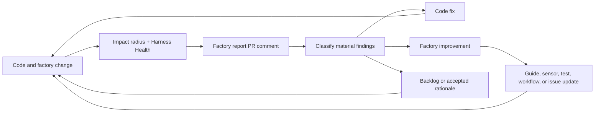

# Factory

Intentive's factory is the system of guides, sensors, workflows, and improvement loops that lets coding agents make useful changes with less review toil and fewer repeated mistakes.

The product is not only the codebase. The product-building system is also part of what we are building: how work is specified, how agents navigate context, how changes are checked, how review findings become new controls, and how CI/CD turns source into shipped software.

This document translates three Martin Fowler / Thoughtworks articles into this repo's operating model:

- Birgitta Bockeler's [Harness engineering for coding agent users](https://martinfowler.com/articles/harness-engineering.html)
- Birgitta Bockeler's [Maintainability sensors for coding agents](https://martinfowler.com/articles/sensors-for-coding-agents.html)
- Kief Morris's [Humans and Agents in Software Engineering Loops](https://martinfowler.com/articles/exploring-gen-ai/humans-and-agents.html)

## Purpose

The factory has three jobs:

1. Increase the chance that an agent starts in the right place.
2. Give the agent fast feedback while it is working.
3. Turn repeated mistakes into a better product-building system.

The mental model is **build the machine that builds the machine**. Like a strong manufacturing system, the point is not only to produce the next unit. The point is to improve the factory that produces every future unit. Toyota is the useful real-world analogy: the factory is not invisible plumbing around the car; the factory is a designed system whose quality determines the quality, speed, cost, and reliability of everything it produces.

The goal is the **agentic flywheel**:

1. Humans define product intent, quality bars, and constraints.
2. Agents use guides to produce changes inside those constraints.
3. Sensors measure the result with fast deterministic checks and slower semantic review.
4. Agents and humans use those signals to improve both the codebase and the harness.
5. The next agent starts with a better factory than the previous one had.

This is not a replacement for human judgment. It is a way to move humans **on the loop**: steering the system that produces software, instead of manually rediscovering the same repo rules or inspecting every line as the primary quality control.

The flywheel only works when factory improvements are treated as real deliverables. A shipped feature that leaves behind a better test fixture, sharper lint message, clearer ADR, smaller issue template, or more useful sensor has improved the future throughput of the whole system.

## Mental Model

| Control           | Direction                                     | In Intentive                                                                                |
| ----------------- | --------------------------------------------- | ------------------------------------------------------------------------------------------- |
| Guide             | Feedforward: steer before work starts         | `AGENTS.md`, `CONTEXT-MAP.md`, deployable `CONTEXT.md`, ADRs, plans, issue tracker docs     |
| Sensor            | Feedback: observe after work happens          | `pnpm harness`, lints, typecheck, tests, contract drift checks, impact-radius reports       |
| Computational     | Deterministic and cheap enough to run often   | TypeScript, Rust tests, ESLint architecture rules, markdown link checks, Zod contract tests |
| Inferential       | Semantic review and judgment                  | Code review, architecture review, security review, design review, planning critique         |
| Human on the loop | Human steers the system, not every artifact   | Review factory gaps, approve trade-offs, prioritize improvements                            |
| Agentic flywheel  | Agents help improve the loop they run in      | Sensor output becomes guide updates, new tests, backlog items, or better harness tools      |
| Factory asset     | A durable part of the product-building system | Scripts, prompts, fixtures, lints, docs, CI jobs, issue templates, review rubrics           |

The factory is healthy when guides and sensors reinforce each other and improve together. If a sensor catches the same problem repeatedly, improve the guide. If a guide keeps being ignored, add or sharpen a sensor. If a review takes too much human interpretation, make the factory asset that would have made the review easier.

## Current Guides

| Guide                                   | Owns                                                   | Use it when                                                                                  |
| --------------------------------------- | ------------------------------------------------------ | -------------------------------------------------------------------------------------------- |
| [`AGENTS.md`](../AGENTS.md)             | Repo entry map, issue tracker policy, inviolable rules | Starting any change                                                                          |
| [`CONTEXT-MAP.md`](../CONTEXT-MAP.md)   | Product-wide language and cross-context relationships  | Naming, domain language, deployable boundaries                                               |
| Deployable `AGENTS.md`                  | Local working rules                                    | Editing `apps/mobile`, `apps/desktop`, `services/control-plane`, or `services/agent-runtime` |
| Deployable `CONTEXT.md`                 | Context-owned vocabulary                               | Adding terms, renaming concepts, avoiding drift                                              |
| [`ARCHITECTURE.md`](../ARCHITECTURE.md) | Layer rule, topology, package ownership                | Changing module boundaries or shared package responsibilities                                |
| [`docs/TESTING.md`](TESTING.md)         | Verification commands and ownership                    | Choosing the right checks before handoff                                                     |
| [`docs/ISSUE-BOARD.md`](ISSUE-BOARD.md) | Sequenced v1 backlog and dependencies                  | Picking scope or checking whether work belongs in another issue                              |
| [`docs/adr/`](adr/)                     | System-wide decisions                                  | Making or checking non-trivial architecture decisions                                        |
| Deployable `docs/adr/`                  | Context-local decisions                                | Making or checking deployable-specific decisions                                             |

## Current Sensors

Run sensors as close to the change as possible. Cheap deterministic checks belong in the agent's local loop; heavier or broader checks belong before handoff or in CI.

| Sensor                 | Command                       | Signal                                                                                             |
| ---------------------- | ----------------------------- | -------------------------------------------------------------------------------------------------- |
| Root harness           | `pnpm harness`                | Preferred pre-handoff gate for agent-authored changes                                              |
| Impact radius          | `pnpm sensor:impact-radius`   | Changed-file coupling and affected-workspace hints for review triage                               |
| Contract drift         | `pnpm sensor:contract-drift`  | Detects local redefinitions of shared protocol/API contracts                                       |
| Harness health         | `pnpm sensor:harness-health`  | Advisory ready-for-review drift report                                                             |
| Factory report         | `pnpm sensor:factory-report`  | Aggregates advisory signals into the PR sticky comment and prompts steward classification          |
| Typecheck              | `pnpm typecheck`              | Workspace TypeScript contract health                                                               |
| Lint                   | `pnpm lint`                   | Docs links, context vocabulary, TS architecture rules, ESLint                                      |
| Rust architecture lint | `pnpm lint:architecture:rust` | Desktop Rust layer and structure rules                                                             |
| Tests                  | `pnpm test`                   | Workspace test scripts, including contracts, architecture fixtures, desktop frontend, desktop Rust |
| Coverage               | `pnpm coverage`               | Desktop frontend LCOV visibility                                                                   |
| Format check           | `pnpm format:check`           | Prettier drift in tracked code/config                                                              |

## Sensor Timing

| Moment                           | Run                                                                               |
| -------------------------------- | --------------------------------------------------------------------------------- |
| While diagnosing                 | Small focused tests, typecheck for the touched workspace, relevant sensor scripts |
| Before handoff                   | `pnpm harness`                                                                    |
| Before review on broad changes   | `pnpm sensor:impact-radius` plus `pnpm harness`                                   |
| When touching shared contracts   | `pnpm sensor:contract-drift`, package tests, then `pnpm harness`                  |
| When changing architecture rules | Architecture linter fixture tests, affected lints, then `pnpm harness`            |
| In CI                            | Re-run the deterministic factory on clean infrastructure                          |

## Factory Rules

1. Prefer deterministic sensors first.

   Use typecheck, lint, architecture rules, contract tests, and focused tests before asking for semantic review. Inferential review is best used for product judgment, module design, missing tests, and risks deterministic tools cannot express.

2. Put shared knowledge in one place.

   If two deployables need the same wire shape, it belongs in `packages/protocol`. If two deployables need the same HTTP shape, it belongs in `packages/api-contract`. If two deployables need the same auth, telemetry, or flag behavior, it belongs in `packages/providers`.

3. Make errors useful to agents.

   Custom lint and sensor failures should include the rule, the boundary that was crossed, and the remediation path. A failure that says what to do next is part of the factory, not just a gate.

4. Treat repeated review findings as factory bugs.

   If reviewers repeatedly catch the same issue, add one of:
   - a clearer guide in the owning `AGENTS.md`, `CONTEXT.md`, `ARCHITECTURE.md`, or ADR;
   - a deterministic sensor in `tools/sensors/` or `tools/linters/`;
   - a focused test fixture that captures the failure mode.

   If the right fix is larger than the current change, record it as backlog work instead of letting the insight disappear.

5. Improve the harness along with the codebase.

   A good change can improve only the code. A better change also improves the path for the next change: a narrower issue, a clearer term, a stronger contract test, a better fixture, a more actionable CI failure, or a sensor that points review attention to the right file.

6. Watch for sensor conflict.

   A sensor can improve one quality while degrading another. For example, aggressive function-size rules can push complexity into parameter chains. When signals conflict, record the intended trade-off in the owning guide instead of blindly satisfying every metric.

7. Keep the factory small enough to run.

   The best local sensor is one agents actually run. Put fast, high-confidence checks in `pnpm harness`; keep slower or noisier checks advisory unless they are blocking real defects.

8. Ask agents to improve the factory.

   After non-trivial reviews, CI failures, or production incidents, ask what factory change would have made the problem easier to prevent, detect, or repair. The answer may be a command, fixture, docs update, ADR, prompt, or issue.

## Flywheel Inputs

The flywheel becomes more valuable as the signals get richer. Start with existing repo checks, then add operational and product signals as the product matures.

| Signal             | Today                                            | Future use                                                          |
| ------------------ | ------------------------------------------------ | ------------------------------------------------------------------- |
| Tests and lints    | `pnpm harness`, `pnpm test`, `pnpm lint`         | Automatically propose stronger fixtures when failures repeat        |
| Architecture drift | `pnpm sensor:contract-drift`, architecture lints | Suggest shared-package moves or boundary-rule updates               |
| Review triage      | `pnpm sensor:impact-radius`                      | Prioritize human review and inferential review by blast radius      |
| Harness health     | `pnpm sensor:harness-health`                     | Add ready-for-review recommendations to PRs and backlog             |
| Runtime telemetry  | Not yet wired into this doc                      | Let agents inspect error rate, latency, and delivery failures       |
| Product outcomes   | Not yet wired into this doc                      | Connect changes to user journeys, retention, and commercial signals |

Every flywheel recommendation should name:

- the observed signal;
- the likely factory gap;
- the proposed guide, sensor, test, or workflow change;
- the cost and risk of applying it;
- whether it should be automatic, agent-suggested, or human-approved.

## Harness Health Feedback Loop

`pnpm sensor:factory-report` is the factory's ready-for-review feedback loop. It aggregates `pnpm sensor:impact-radius` and `pnpm sensor:harness-health` into the PR sticky comment, then prints the classification handoff reviewers and agents should complete for material findings. It is advisory on purpose: it should steer attention, generate improvement work, and make factory drift visible without pretending to be a complete quality score.

Read the report as a systems signal, not a checklist. Each section points at a different way the product-building system can drift:

| Harness Health signal     | Systems interpretation                                              | Feedback action                                                                                                                                                  |
| ------------------------- | ------------------------------------------------------------------- | ---------------------------------------------------------------------------------------------------------------------------------------------------------------- |
| Changed files             | Where energy entered the system                                     | Focus review on the actual change surface                                                                                                                        |
| Stale scaffolds           | Planned structure has not become real behavior yet                  | Replace scaffold with product behavior, or create the issue that will                                                                                            |
| Oversized files           | Local complexity is accumulating faster than boundaries are forming | Split only around named domain responsibilities or add a follow-up refactor issue                                                                                |
| High fan-in modules       | A change has a large blast radius                                   | Increase review depth, add contract tests, or move shared knowledge to the right package                                                                         |
| Suppressions              | The factory is tolerating rule exceptions                           | Remove stale suppressions or document why the exception remains load-bearing                                                                                     |
| Forbidden vocabulary hits | Product language is drifting                                        | Update the source term, update the owning context if the product language changed, or allowlist a genuine technical term (npm package, vendor API) in the sensor |
| Dependency freshness      | External supply chain is aging                                      | Upgrade, defer with rationale, or open a dependency-maintenance issue                                                                                            |
| Untested public exports   | API surface is growing faster than behavioral proof                 | Add focused tests, reduce the export surface, or record why the export is intentionally untested                                                                 |

Use two loops:

1. **Balancing loop: reduce current drift.** Fix the specific finding when it is clearly part of the current change.
2. **Reinforcing loop: improve the factory.** When the finding reveals a repeated pattern, improve the guide, sensor, fixture, CI job, or issue template so the next agent starts with a stronger system.

The PR sticky comment is the loop handoff. Before merging a non-trivial change, the reviewer or agent should classify each material factory-report finding as one of:

- **Fixed now**: the current change removes the drift.
- **Factory improved**: the current change adds or sharpens a guide, sensor, test, workflow, or review rubric.
- **Backlogged**: the current change records the improvement as an issue or plan item with enough context for a future agent.
- **Accepted**: the finding is intentionally tolerated, and the rationale is documented where future agents will see it.

The loop is working when repeated findings become rarer, not when every PR comment is empty. An empty report can mean a healthy system, but it can also mean the sensor is not looking for the right failure modes yet.

## Factory Assets

Factory assets are part of the product-building system. They deserve the same care as runtime code because they shape every future change.

| Asset              | Improvement question                                           |
| ------------------ | -------------------------------------------------------------- |
| Docs               | Did the next agent get to the right file faster?               |
| ADRs               | Is the trade-off recorded where future work will look for it?  |
| Issues and PRDs    | Is the scope small, sequenced, and testable?                   |
| Tests and fixtures | Would this catch the failure mode without human memory?        |
| Lints and sensors  | Does the failure explain the rule and the next action?         |
| CI/CD              | Does the pipeline catch the right risks at the right cost?     |
| Prompts and skills | Do they encode the hard-won operating knowledge?               |
| Review rubrics     | Do they focus human attention on judgment, not routine checks? |

## What Belongs In `tools/`

Use `tools/linters/` when the rule is about code structure and can be enforced by parsing files or imports.

Use `tools/sensors/` when the output is a review or drift signal, especially if it is advisory, change-set aware, or intended to help the agent decide where to spend attention.

Use `tools/harness/` when combining deployable-specific checks into the standard pre-handoff gate.

Every new factory tool should have:

- a root `package.json` script;
- fixture or unit coverage;
- output written for an agent reader, not only a human expert;
- a short mention in [`docs/TESTING.md`](TESTING.md);
- a link from this file if it changes agent workflow.

## Improvement Backlog

These are good next factory upgrades when the matching product surface becomes real:

- Add domain-level fixtures as `services/control-plane` and `services/agent-runtime` move beyond scaffold tests.
- Add coverage thresholds only after the covered surface is representative enough to avoid noisy gates.
- Add mutation testing for shared contract mappers and high-risk pure functions.
- Add property-based tests for protocol parsing, idempotency, ordering, and reconnect semantics.
- Add a recurring inferential modularity review seeded by `pnpm sensor:impact-radius`.
- Add security and data-handling sensors for paths that touch auth, device tokens, push notifications, runtime memory, or user content.

## Human Role

Humans steer the factory. Agents can add checks, fix failures, and draft guide updates, but humans decide which constraints are load-bearing and which trade-offs are acceptable for Intentive.

When in doubt, improve the smallest guide or sensor that would have prevented the mistake just observed.
