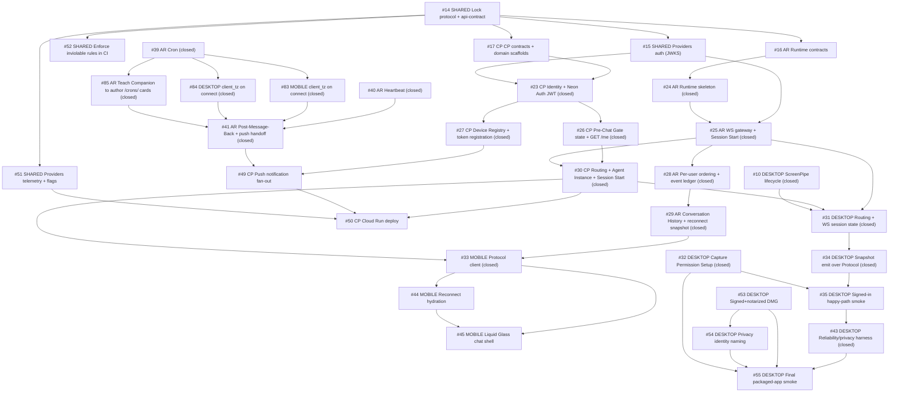

# Issue Board

> Issue numbers are GitHub issue numbers. Click Issue titles to open on GitHub.

## Operating Frame

- Date: 2026-06-17
- Repo: Intentive monorepo (`sruj75/Intentive`)
- Tracker root: [GitHub Issues](https://github.com/sruj75/Intentive/issues) on `sruj75/Intentive` (v1 backlog #7–#56); PRDs at `[docs/prd/](prd/)`
- Closed: `#7`–`#43`, `#83`–`#85` — Desktop v1 foundation (`#7`–`#13`), shared protocol/api-contract + Providers auth (`#14`–`#15`), AR/CP contract roots (`#16`–`#17`, [PR #57](https://github.com/sruj75/Intentive/pull/57)), Mobile foundation lane (`#18`–`#22`, [PR #57](https://github.com/sruj75/Intentive/pull/57), [PR #58](https://github.com/sruj75/Intentive/pull/58)), CP Identity + mobile launch hydration (`#23`, commit `8e65c71`), AR Runtime skeleton + WS gateway and CP Pre-Chat Gate (`#24`–`#26`, [PR #62](https://github.com/sruj75/Intentive/pull/62)), CP Device Registry + device-aware gates (`#27`, [PR #63](https://github.com/sruj75/Intentive/pull/63)), AR Sessions / Ordering / Event Ledger (`#28`, commit `ce43ad7`), AR Conversation History + reconnect snapshot (`#29`, [PR #65](https://github.com/sruj75/Intentive/pull/65)), CP Routing + Agent Instance + Session Start (`#30`, commit `a703b1e`), Desktop Routing + Protocol WS session (`#31`, [PR #71](https://github.com/sruj75/Intentive/pull/71)), Desktop Capture Permission Setup (`#32`, [PR #72](https://github.com/sruj75/Intentive/pull/72)), Mobile Protocol Runtime Adapter (`#33`, [PR #73](https://github.com/sruj75/Intentive/pull/73)), Desktop Snapshot emit over Protocol (`#34`, [PR #76](https://github.com/sruj75/Intentive/pull/76)), Desktop Signed-in Capture Session smoke (`#35`, branch `issue-35`), AR DeepAgents interactive turn (`#36`, [PR #79](https://github.com/sruj75/Intentive/pull/79)), AR Procedure Floor + Per-User Memory (`#37`, branch `issue-37`), AR Context Snapshots + Session End Markers (`#38`, [PR #81](https://github.com/sruj75/Intentive/pull/81)), AR Cron (`#39`, branch `issue-39`), AR Heartbeat (`#40`, branch `issue-40and41`, commit `7942186`), AR Post-Message-Back + push handoff (`#41`, branch `issue-40and41`, commit `7942186`), AR Observability / prod readiness (`#42`, branch `issue-42`, commit `3edfc46`), Desktop Reliability/privacy verification harness (`#43`, branch `issue-43`, commit `5bef268`), Cron activation lane — Mobile `client_tz` (`#83`, branch `commit-push-all-changes`), Desktop `client_tz` (`#84`, branch `commit-push-all-changes`), Floor cron authoring (`#85`, branch `commit-push-all-changes`)
- Open: `#44`–`#56` (excluding `#83`–`#85`, closed out-of-sequence as #39 follow-ups)

## Executive Next Move

**Latest closure:** [#43 Desktop Reliability/privacy verification harness](https://github.com/sruj75/Intentive/issues/43) (branch `issue-43`, commit `5bef268`) — ADR-0023 three-guarantee verification map (A local invariants, B cross-language contract, C privacy efficacy eval), `pnpm eval:privacy` + `EVAL.md`, no-retry test pins ADR-0005; unblocks #55. Prior closure: [#42 AR Observability / prod readiness](https://github.com/sruj75/Intentive/issues/42) (branch `issue-42`, commit `3edfc46`, [PR #90](https://github.com/sruj75/Intentive/pull/90)).

**Now:** [#49 CP Push notification fan-out](https://github.com/sruj75/Intentive/issues/49) — AR egress + observability landed; CP completes Post-Message-Back → APNs. Client lane [#44](https://github.com/sruj75/Intentive/issues/44) and shared [#51](https://github.com/sruj75/Intentive/issues/51)/[#52](https://github.com/sruj75/Intentive/issues/52) remain independently startable; Desktop packaging lanes [#53](https://github.com/sruj75/Intentive/issues/53)/[#54](https://github.com/sruj75/Intentive/issues/54) gate [#55](https://github.com/sruj75/Intentive/issues/55).

What it unlocks:

- `#31` + `#34` + `#35` + `#43` (closed) → Desktop `#55` — final packaged-app smoke (still gated on `#53`/`#54`).
- `#29` + `#30` + `#33` + `#36` + `#37` + `#38` + `#39` + `#40` + `#41` (closed) → Mobile `#44` and CP `#49` — mobile reconnect and CP push fan-out lanes.
- `#27` (closed) + `#41` (closed) → `#49` (push fan-out) — AR handoff client landed; CP owns APNs delivery.
- `#15` (closed) → `#51` (telemetry/flags) → `#52` (CI rule enforcement).

## Dependency Map

## Sequenced Backlog

### Closed

| #   | Deployable    | Issue                                                                                                                  | Status                                                                                                                                                                                                                                                                                                                                                        |
| --- | ------------- | ---------------------------------------------------------------------------------------------------------------------- | ------------------------------------------------------------------------------------------------------------------------------------------------------------------------------------------------------------------------------------------------------------------------------------------------------------------------------------------------------------- |
| 7   | Desktop       | [Lock v1 model and Agent Interface contract](https://github.com/sruj75/Intentive/issues/7)                             | closed                                                                                                                                                                                                                                                                                                                                                        |
| 8   | Desktop       | [Replace starter scaffold with Intentive menu bar shell](https://github.com/sruj75/Intentive/issues/8)                 | closed                                                                                                                                                                                                                                                                                                                                                        |
| 9   | Desktop       | [Add minimal Settings account shell](https://github.com/sruj75/Intentive/issues/9)                                     | closed                                                                                                                                                                                                                                                                                                                                                        |
| 10  | Desktop       | [Manage ScreenPipe Capture Session lifecycle end to end](https://github.com/sruj75/Intentive/issues/10)                | closed                                                                                                                                                                                                                                                                                                                                                        |
| 11  | Desktop       | [Establish local snapshot store with retention](https://github.com/sruj75/Intentive/issues/11)                         | closed                                                                                                                                                                                                                                                                                                                                                        |
| 12  | Desktop       | [Manage Ollama readiness and first-run setup](https://github.com/sruj75/Intentive/issues/12)                           | closed                                                                                                                                                                                                                                                                                                                                                        |
| 13  | Desktop       | [Produce a Context Snapshot on fixed 10-minute heartbeat cycle](https://github.com/sruj75/Intentive/issues/13)         | closed                                                                                                                                                                                                                                                                                                                                                        |
| 14  | Shared        | [Lock Protocol + API-Contract V1](https://github.com/sruj75/Intentive/issues/14)                                       | closed                                                                                                                                                                                                                                                                                                                                                        |
| 15  | Shared        | [Providers auth (JWKS)](https://github.com/sruj75/Intentive/issues/15)                                                 | closed                                                                                                                                                                                                                                                                                                                                                        |
| 16  | Agent Runtime | [Resolve Runtime Contracts](https://github.com/sruj75/Intentive/issues/16)                                             | closed                                                                                                                                                                                                                                                                                                                                                        |
| 17  | Control Plane | [CP Contracts + Domain Scaffolds](https://github.com/sruj75/Intentive/issues/17)                                       | closed                                                                                                                                                                                                                                                                                                                                                        |
| 18  | Mobile        | [Scaffold Expo App + Launch State Resolver](https://github.com/sruj75/Intentive/issues/18)                             | closed ([PR #57](https://github.com/sruj75/Intentive/pull/57))                                                                                                                                                                                                                                                                                                |
| 19  | Mobile        | [Identity Gate](https://github.com/sruj75/Intentive/issues/19)                                                         | closed ([PR #58](https://github.com/sruj75/Intentive/pull/58))                                                                                                                                                                                                                                                                                                |
| 20  | Mobile        | [Consent Primer](https://github.com/sruj75/Intentive/issues/20)                                                        | closed ([PR #58](https://github.com/sruj75/Intentive/pull/58))                                                                                                                                                                                                                                                                                                |
| 21  | Mobile        | [Sibling Client Invitation (macOS Setup)](https://github.com/sruj75/Intentive/issues/21)                               | closed ([PR #58](https://github.com/sruj75/Intentive/pull/58))                                                                                                                                                                                                                                                                                                |
| 22  | Mobile        | [assistant-ui/native Spike](https://github.com/sruj75/Intentive/issues/22)                                             | closed ([PR #58](https://github.com/sruj75/Intentive/pull/58))                                                                                                                                                                                                                                                                                                |
| 23  | Control Plane | [Identity + Neon Auth JWT](https://github.com/sruj75/Intentive/issues/23)                                              | closed (`8e65c71`) — `GET /me`, users repo, mobile launch source                                                                                                                                                                                                                                                                                              |
| 24  | Agent Runtime | [Runtime Skeleton](https://github.com/sruj75/Intentive/issues/24)                                                      | closed ([PR #62](https://github.com/sruj75/Intentive/pull/62)) — module seams, domain scaffolds                                                                                                                                                                                                                                                               |
| 25  | Agent Runtime | [WS Gateway + Session Start](https://github.com/sruj75/Intentive/issues/25)                                            | closed ([PR #62](https://github.com/sruj75/Intentive/pull/62)) — gateway connect + WS handler, session registry                                                                                                                                                                                                                                               |
| 26  | Control Plane | [Pre-Chat Gate state + GET /me](https://github.com/sruj75/Intentive/issues/26)                                         | closed ([PR #62](https://github.com/sruj75/Intentive/pull/62)) — user-gates domain, `0002_user_gates`                                                                                                                                                                                                                                                         |
| 27  | Control Plane | [Device Registry + token registration](https://github.com/sruj75/Intentive/issues/27)                                  | closed ([PR #63](https://github.com/sruj75/Intentive/pull/63)) — `devices` domain, `0003_devices`, ADR-0005                                                                                                                                                                                                                                                   |
| 28  | Agent Runtime | [Sessions / Ordering / Event Ledger](https://github.com/sruj75/Intentive/issues/28)                                    | closed (`ce43ad7`) — event ledger, per-user queue, ingest wiring, ADR-0007                                                                                                                                                                                                                                                                                    |
| 29  | Agent Runtime | [Conversation History + Reconnect Snapshot](https://github.com/sruj75/Intentive/issues/29)                             | closed ([PR #65](https://github.com/sruj75/Intentive/pull/65)) — `conversation` domain, transcript, snapshot + backfill (ADR-0006/0008/0009); companion persist landed in #36; live delivery landed in #41                                                                                                                                                    |
| 30  | Control Plane | [Routing + Agent Instance + Session Start](https://github.com/sruj75/Intentive/issues/30)                              | closed (`a703b1e`) — `GET /agent`, Agent Instance Registry (`0004_agent_instances.sql`), Session Start client, pass-through `runtime_jwt` (ADR-0002), gate enforcement                                                                                                                                                                                        |
| 31  | Desktop       | [Routing + Protocol WS Session](https://github.com/sruj75/Intentive/issues/31)                                         | closed ([PR #71](https://github.com/sruj75/Intentive/pull/71)) — Rust `routing` domain, Control Plane `GET /agent`, Routing/Session state, Protocol WS skeleton, Settings connection mood (ADR-0019); snapshot emit landed in #34                                                                                                                             |
| 32  | Desktop       | [Capture Permission Setup](https://github.com/sruj75/Intentive/issues/32)                                              | closed ([PR #72](https://github.com/sruj75/Intentive/pull/72)) — Opal-style permission wizard, `providers/permissions/`, `permission_monitor`, `SetupRequired` shell state, local three-grant interlock (ADR-0020/0021); eager revocation detection remains deferred post-#43                                                                                 |
| 33  | Mobile        | [Protocol client for Companion Chat](https://github.com/sruj75/Intentive/issues/33)                                    | closed ([PR #73](https://github.com/sruj75/Intentive/pull/73)) — Runtime Adapter, external-store runtime, Message Store, routing client, ADR-0015/0016; Liquid Glass shell deferred to #45                                                                                                                                                                    |
| 34  | Desktop       | [Emit Context Snapshots over Protocol](https://github.com/sruj75/Intentive/issues/34)                                  | closed ([PR #76](https://github.com/sruj75/Intentive/pull/76)) — `WsSessionAgentSink` bridge, `context_snapshot` + `session_end_marker` over live `WsSession`, `pushed_at` on socket-write acceptance, golden contract tests, ADR-0005 at-most-once                                                                                                           |
| 35  | Desktop       | [Signed-in happy-path smoke](https://github.com/sruj75/Intentive/issues/35)                                            | closed (branch `issue-35`) — `@intentive/desktop-smoke` harness, dev-gated smoke hooks, ADR-0022 marker-before-ScreenPipe ordering; runbook `apps/desktop/docs/SMOKE.md`; unblocks #43/#55                                                                                                                                                                    |
| 36  | Agent Runtime | [DeepAgents integration](https://github.com/sruj75/Intentive/issues/36)                                                | closed ([PR #79](https://github.com/sruj75/Intentive/pull/79)) — DeepAgents adapter + turn-runner on Per-User Channel, Postgres checkpointing, companion persist via `conversation.append`, `runtime_turns` + Langfuse, ADR-0020 turn-failure containment; unblocks #37                                                                                       |
| 37  | Agent Runtime | [VFS / Bundles / Memory](https://github.com/sruj75/Intentive/issues/37)                                                | closed (branch `issue-37`) — Procedure Floor (Langfuse + deploy-bundled fallback), per-connection pinning, native `StoreBackend` Per-User Memory + `USER.md` injection, `runtime_turns.bundle_version`, ADR-0021/0022; unblocks #38/#42                                                                                                                       |
| 38  | Agent Runtime | [Context Snapshots + Session End Markers](https://github.com/sruj75/Intentive/issues/38)                               | closed ([PR #81](https://github.com/sruj75/Intentive/pull/81)) — Sensory Buffer projection over durable `context_snapshot`/`session_end_marker` ingress, `onPerceptionArrived`, `RECENT_PERCEPTION` prompt injection, migration `0005`, ADR-0023; unblocks #40                                                                                                |
| 39  | Agent Runtime | [Cron](https://github.com/sruj75/Intentive/issues/39)                                                                  | closed (branch `issue-39`) — `/crons/` filesystem cards, poll-loop scheduler, initial ephemeral silent cron turns + `cron_runs`, `client_tz` persistence, migrations `0006`–`0008`, ADR-0024/0025/0026; main-thread flip in #41 (ADR-0029)                                                                                                                    |
| 83  | Mobile        | [Report device IANA timezone as `client_tz` on connect](https://github.com/sruj75/Intentive/issues/83)                 | closed (branch `commit-push-all-changes`, commit `5c34f68`) — injectable `resolveTimeZone` in Runtime Adapter, optional `client_tz` on every connect/reconnect, `test/runtime-adapter.test.mjs`; completes #39 client half (ADR-0025)                                                                                                                         |
| 84  | Desktop       | [Report host IANA timezone as `client_tz` on connect](https://github.com/sruj75/Intentive/issues/84)                   | closed (branch `commit-push-all-changes`, commit `5c34f68`) — `iana-time-zone` at I/O edge, `build_connect_frame` helper, optional `client_tz` per connection, Rust unit tests; completes #39 client half (ADR-0025)                                                                                                                                          |
| 85  | Agent Runtime | [Teach the Companion to schedule via `/crons/` cards (Floor authoring)](https://github.com/sruj75/Intentive/issues/85) | closed (branch `commit-push-all-changes`, commit `5c34f68`) — `bundles/repo/floor/cron-authoring.md` documents card format, 5-minute minimum, cancel/one-shot semantics, Cron vs Heartbeat rule; activates #39 engine for agent-authored schedules (ADR-0026)                                                                                                 |
| 40  | Agent Runtime | [Heartbeat](https://github.com/sruj75/Intentive/issues/40)                                                             | closed (branch `issue-40and41`, commit `7942186`) — computed zero-state poll scheduler over `agent_instances` + latest `runtime_turns`, best-effort Monitoring Turn enqueue on the Per-User Channel, ADR-0027; shipped with #41                                                                                                                               |
| 41  | Agent Runtime | [Post-Message-Back + push handoff](https://github.com/sruj75/Intentive/issues/41)                                      | closed (branch `issue-40and41`, commit `7942186`) — `delivery/` domain, shared `DeliveryPort`, connection registry, CP push client, `post_message_back` tool, unified `deliveries` ledger, interactive reply streaming, Cron main-thread flip (ADR-0028/0029); unblocks #49                                                                                   |
| 42  | Agent Runtime | [Observability / safety / prod readiness](https://github.com/sruj75/Intentive/issues/42)                               | closed (branch `issue-42`, commit `3edfc46`, [PR #90](https://github.com/sruj75/Intentive/pull/90)) — ADR-0030 off-the-shelf observability: `bootstrapObservability` (Sentry + Langfuse isolated OTel), structured logs at domain seams, metadata-only redaction, multi-user isolation + reconnect + restart-smoke integration tests, production `Dockerfile` |
| 43  | Desktop       | [Reliability + privacy verification harness](https://github.com/sruj75/Intentive/issues/43)                            | closed (branch `issue-43`, commit `5bef268`) — ADR-0023 three-guarantee verification map (A local invariants, B cross-language contract, C privacy efficacy eval), `pnpm eval:privacy` + `EVAL.md`, no-retry test pins ADR-0005; verification map in `docs/TESTING.md`; unblocks #55                                                                          |

### Open

| #   | Deployable         | Issue                                                                                          | Notes                                                                                           |
| --- | ------------------ | ---------------------------------------------------------------------------------------------- | ----------------------------------------------------------------------------------------------- |
| 44  | Mobile             | [Reconnect hydration](https://github.com/sruj75/Intentive/issues/44)                           | `#33` + `#29` closed; server-truth conversation behavior; unblocks #45                          |
| 45  | Mobile             | [Liquid Glass chat shell + Floating Composer](https://github.com/sruj75/Intentive/issues/45)   | Blocked by #33/#44; first full chat experience                                                  |
| 46  | Mobile             | [Account Surface](https://github.com/sruj75/Intentive/issues/46)                               | Blocked by #21/#45; setup recovery + status surface                                             |
| 47  | Mobile             | [Continuity / Agent State / Capability-Honesty](https://github.com/sruj75/Intentive/issues/47) | Blocked by #44/#45/#46; capability-honesty polish                                               |
| 48  | Mobile             | [E2E verification + visual polish pass](https://github.com/sruj75/Intentive/issues/48)         | Blocked by most prior mobile slices; final mobile release confidence                            |
| 49  | Control Plane      | [Push notification fan-out](https://github.com/sruj75/Intentive/issues/49)                     | `#41` closed (AR handoff client landed); `#27` closed (device registry) — CP owns APNs delivery |
| 50  | Control Plane      | [Cloud Run deploy + prod readiness](https://github.com/sruj75/Intentive/issues/50)             | Blocked by #30 closed/#49/#51; re-enables skipped deploy workflow; production CP                |
| 51  | Shared             | [Providers telemetry + feature flags](https://github.com/sruj75/Intentive/issues/51)           | `#14` closed; observability for #50                                                             |
| 52  | Shared             | [Enforce inviolable rules in CI](https://github.com/sruj75/Intentive/issues/52)                | `#14` closed; keeps layer/boundary/vocabulary/version rules from rotting                        |
| 53  | Desktop            | [Signed + notarized DMG](https://github.com/sruj75/Intentive/issues/53)                        | Human signing credentials; can run in parallel with runtime lane                                |
| 54  | Desktop            | [macOS Privacy Settings identity](https://github.com/sruj75/Intentive/issues/54)               | Blocked by #53; required for #55                                                                |
| 55  | Desktop            | [Final packaged-app release smoke](https://github.com/sruj75/Intentive/issues/55)              | Blocked by #53/#54; release bar (#43 closed)                                                    |
| 56  | Desktop (optional) | [In-app updates (check / notify / install)](https://github.com/sruj75/Intentive/issues/56)     | Not on core capture-runtime critical path; improves post-launch operability                     |

## Blocked / Waiting

| Issue                                  | Waiting on                                   | Evidence                                               | Next check                                         |
| -------------------------------------- | -------------------------------------------- | ------------------------------------------------------ | -------------------------------------------------- |
| #53 Desktop — Signed/notarized DMG     | Human Apple signing/notarization credentials | Issue notes explicit human credential dependency       | Confirm credential readiness before packaging pass |
| #55 Desktop — Final packaged-app smoke | #53, #54                                     | Explicit `Blocked by` chain in issue (#43 closed)      | Re-evaluate once packaging pass exists             |
| #48 Mobile — E2E verification          | Most mobile stack                            | Explicit broad blocker list including core chat slices | Treat as terminal verification gate only           |

## Per-Deployable Status

### Shared / Cross-Cutting (issues #14–#15, #51–#52)

- `#14` (protocol/api-contract lock) and `#15` (Providers JWKS auth) are **closed**.
- **Next:** `#51` (telemetry/flags) and `#52` (CI rules) only depend on `#14`; run them while other lanes progress.
- `packages/providers/src/auth.ts` now ships a real `jose`-backed `createJwtVerifier` (see `packages/providers/test/auth.test.mjs`); `#23` (closed) and `#25` consume it from `@intentive/providers/auth`.

### Mobile Client (issues #18–#22, #33 closed; #44–#48 open)

- Foundation lane **closed** (`#18`–`#22`): Expo scaffold + launch resolver ([PR #57](https://github.com/sruj75/Intentive/pull/57)); Identity Gate, Consent Primer, Sibling Invitation, CompanionChat / assistant-ui spike ([PR #58](https://github.com/sruj75/Intentive/pull/58)).
- `#23` slice on mobile (`8e65c71`): `createControlPlaneLaunchStateSource` + `mapAccountStateToLaunchState` wired at boot; `EXPO_PUBLIC_CONTROL_PLANE_BASE_URL`. Remainder (real Neon OAuth redirect, cold-launch restore with live session) tracks follow-on issues.
- `#33` (Protocol client) **closed** ([PR #73](https://github.com/sruj75/Intentive/pull/73)): Runtime Adapter + external-store runtime, in-memory Message Store, routing client, outbound delivery hardening, ADR-0015/0016.
- `#83` (device `client_tz` on connect) **closed** (branch `commit-push-all-changes`, commit `5c34f68`): Runtime Adapter reports optional `client_tz` on every connect/reconnect (ADR-0025).
- **Next:** `#44`–`#48` chat polish and release slices — reconnect hydration, Liquid Glass shell, Account Surface, capability honesty, E2E verification.
- Cross-project dependency: chat slices rely on closed AR `#25`/`#29`, closed CP Routing `#30`, and the closed `#33` Runtime Adapter.

### Desktop Client (issues #7–#13, #31–#35, #43 closed; #53–#56 open)

- `#7`–`#13` closed.
- `#31` (Routing + Protocol WS Session) **closed** ([PR #71](https://github.com/sruj75/Intentive/pull/71)): Rust `routing` domain owns Control Plane `GET /agent`, Routing/Session state machine (`signed_out` / `signed_in` / `routing_ready` / `routing_error`), and Protocol WebSocket session lifecycle; webview syncs login tokens and Settings shows connection mood only; fixture fallback for local dev ([ADR-0019](https://github.com/sruj75/Intentive/blob/main/apps/desktop/docs/adr/0019-desktop-rust-owns-routing-and-ws-session.md)).
- `#32` (Capture Permission Setup) **closed** ([PR #72](https://github.com/sruj75/Intentive/pull/72)): Opal-style sequential wizard (`CapturePermissionSetup.tsx`, `?surface=permission-setup`), `providers/permissions/` grant probes, `permission_monitor` poll loop, `SetupRequired` shell state with menu bar **Finish Setup…**, and local three-grant **Desktop Capture Readiness** interlock over the Control Plane capture gate ([ADR-0020](https://github.com/sruj75/Intentive/blob/main/apps/desktop/docs/adr/0020-desktop-local-three-grant-interlock-authoritative-over-cp-capture-gate.md), [ADR-0021](https://github.com/sruj75/Intentive/blob/main/apps/desktop/docs/adr/0021-desktop-permission-detection-adapted-from-screenpipe.md)).
- `#34` (Emit Context Snapshots over Protocol) **closed** ([PR #76](https://github.com/sruj75/Intentive/pull/76)): `WsSessionAgentSink` bridge frames `context_snapshot` and `session_end_marker` through the live Routing `WsSession`, stamps `pushed_at` on socket-write acceptance (ADR-0005 at-most-once), golden fixtures + Rust/Vitest contract tests lock the serializer to `@intentive/protocol`.
- `#35` (Signed-in Capture Session smoke) **closed** (branch `issue-35`): `@intentive/desktop-smoke` harness (`apps/desktop/smoke/`) proves the full signed-in chain on a Mac with all three grants; dev-gated smoke hooks in `providers/smoke.rs`; ADR-0022 reverses `Effect::StopSession` so the marker leaves before ScreenPipe shutdown; runbook at [`apps/desktop/docs/SMOKE.md`](../apps/desktop/docs/SMOKE.md).
- `#84` (host `client_tz` on connect) **closed** (branch `commit-push-all-changes`, commit `5c34f68`): Routing reads host IANA zone via `iana-time-zone` and includes optional `client_tz` on every connect (ADR-0025).
- `#43` (Reliability/privacy verification harness) **closed** (branch `issue-43`, commit `5bef268`): ADR-0023 three-guarantee verification map — **A** local invariants (Rust unit tests every commit), **B** cross-language contract (`protocol-contract.test.ts` + golden fixtures), **C** privacy efficacy eval (`pnpm eval:privacy`, `apps/desktop/docs/EVAL.md`, planted-token `#[ignore]`d test); criterion→proof table in `docs/TESTING.md`; no-retry test pins ADR-0005; unblocks #55.
- **Next:** Signed/notarized DMG (`#53`) and macOS Privacy Settings identity (`#54`) gate final packaged-app smoke (`#55`).
- Cross-project dependency: Signed-in smoke and the reliability harness need AR gateway semantics and protocol compatibility (both satisfied by the #35 harness + closed #34 emit path).

### Control Plane (issues #17, #23, #26–#27, #30 closed; #49–#50 open)

- `#17` (CP Contracts + Domain Scaffolds) **closed** ([PR #57](https://github.com/sruj75/Intentive/pull/57)).
- `#23` (Identity + Neon Auth JWT) **closed** (`8e65c71`): identity domain (`GET /me`, users repo, `migrations/0001_users.sql`), PR CI (`.github/workflows/control-plane-ci.yml`), ADR-0003 repo integration tests.
- `#26` (Pre-Chat Gate state + GET /me) **closed** ([PR #62](https://github.com/sruj75/Intentive/pull/62)): user-gates domain computing `next_gate` plus consent/sibling-skip/ack endpoints, backed by `migrations/0002_user_gates.sql`.
- `#27` (Device Registry + token registration) **closed** ([PR #63](https://github.com/sruj75/Intentive/pull/63)): `devices` domain with idempotent `POST /devices/register`, `migrations/0003_devices.sql`, `listDevicesForUser` read port, and device-aware gate sequencing via live client signals ([ADR-0005](https://github.com/sruj75/Intentive/blob/main/services/control-plane/docs/adr/0005-device-aware-gates-from-live-signals.md)).
- `#30` (Routing + Session Start) **closed** (commit `a703b1e`): `agents` domain with Agent Instance Registry (`migrations/0004_agent_instances.sql`), Runtime Session Start client, `GET /agent` with pass-through Neon Auth `runtime_jwt` (ADR-0002), server-side gate enforcement, and `has_agent_instance` wired into `identity.resolveAccount`.
- **Next:** `#49` (push fan-out) — AR `#41` handoff client landed; `#50` (Cloud Run deploy) once `#49` and `#51` land.
- Cross-project dependency: depends on `#14` (api-contract lock) and `#15` (Providers auth); calls AR `POST /internal/sessions/start` and receives `POST /internal/notifications/push`.

### Agent Runtime (issues #16, #24, #25, #28–#29, #36–#42 closed)

- `#16` (Resolve Runtime Contracts) **closed** ([PR #57](https://github.com/sruj75/Intentive/pull/57)).
- `#24` (Runtime Skeleton) and `#25` (WS Gateway + Session Start) **closed** ([PR #62](https://github.com/sruj75/Intentive/pull/62)): real connection control — gateway connect + WS handler, session start/registry, env config, `main.ts` bootstrap — replacing the prior scaffolds.
- `#28` (Sessions / Ordering / Event Ledger) **closed** (commit `ce43ad7`): Neon-backed Agent Instance registry, append-only `runtime_events` idempotency ledger, per-`user_id` in-memory queue, and write-ahead ingest wiring ([ADR-0007](https://github.com/sruj75/Intentive/blob/main/services/agent-runtime/docs/adr/0007-agent-runtime-event-ledger-and-in-memory-ordering.md)).
- `#29` (Conversation History + reconnect snapshot) **closed** ([PR #65](https://github.com/sruj75/Intentive/pull/65)): dedicated `conversation` domain ([ADR-0008](https://github.com/sruj75/Intentive/blob/main/services/agent-runtime/docs/adr/0008-agent-runtime-conversation-history-own-domain.md)), durable `conversation_messages` transcript, reconnect Session Snapshot in `hello_ok`, and history backfill over the WebSocket ([ADR-0006 amended](https://github.com/sruj75/Intentive/blob/main/services/agent-runtime/docs/adr/0006-agent-runtime-session-snapshot-as-separate-projection.md), [ADR-0009](https://github.com/sruj75/Intentive/blob/main/services/agent-runtime/docs/adr/0009-agent-runtime-transactional-ingress-projections.md)) for the **user-authored** half. Companion-message persistence landed in `#36`; live outbound delivery + the connected-client registry landed in `#41`.
- `#36` (DeepAgents interactive turn) **closed** ([PR #79](https://github.com/sruj75/Intentive/pull/79)): DeepAgents adapter + `turn-runner` on the Per-User Channel, Postgres checkpointing via LangGraph `PostgresSaver`, companion persist via `conversation.append`, `runtime_turns` observability + Langfuse callbacks, and turn-failure containment without rejecting ingress ack ([ADR-0020](https://github.com/sruj75/Intentive/blob/main/services/agent-runtime/docs/adr/0020-agent-runtime-ingress-ack-decoupled-from-turn-success.md)).
- `#37` (Procedure Floor + Per-User Memory) **closed** (branch `issue-37`): `bundles/` domain for Langfuse-or-bundled Procedure Floor resolution, per-connection pinning at `hello_ok`, trigger-aware prompt assembly; `memory/` domain for native DeepAgents `StoreBackend`/`CompositeBackend` wiring and injected `USER.md`; `runtime_turns.bundle_version` migration ([ADR-0021](https://github.com/sruj75/Intentive/blob/main/services/agent-runtime/docs/adr/0021-agent-runtime-native-vfs-injected-procedure-floor-per-user-store-memory.md), [ADR-0022](https://github.com/sruj75/Intentive/blob/main/services/agent-runtime/docs/adr/0022-agent-runtime-procedure-floor-in-langfuse-registry-first-iteration-loop.md)).
- `#38` (Context Snapshots + Session End Markers) **closed** ([PR #81](https://github.com/sruj75/Intentive/pull/81)): durable `context_snapshot`/`session_end_marker` ingress through the Per-User Channel, `sensory-buffer.ts` read projection over `runtime_events`, `onPerceptionArrived` hook, `RECENT_PERCEPTION` injected into Interactive Turn prompts, migration `0005_runtime_events_user_created_at` ([ADR-0023](https://github.com/sruj75/Intentive/blob/main/services/agent-runtime/docs/adr/0023-agent-runtime-perception-driven-cadence-two-regimes.md)).
- `#39` (Cron) **closed** (branch `issue-39`): `cron/` domain with `/crons/` DeepAgents filesystem cards over `cron_jobs`, `croner` schedule validation, poll-loop scheduler, ephemeral silent cron-turn handler + `cron_runs`, device-reported `client_tz` on connect, migrations `0006`–`0008` ([ADR-0024](https://github.com/sruj75/Intentive/blob/main/services/agent-runtime/docs/adr/0024-agent-runtime-cron-scheduler-poll-loop-not-timer-wheel.md), [ADR-0025](https://github.com/sruj75/Intentive/blob/main/services/agent-runtime/docs/adr/0025-agent-runtime-device-reported-user-timezone.md), [ADR-0026](https://github.com/sruj75/Intentive/blob/main/services/agent-runtime/docs/adr/0026-agent-runtime-cron-is-deepagents-native-filesystem-card.md)).
- `#85` (Floor cron authoring) **closed** (branch `commit-push-all-changes`, commit `5c34f68`): `bundles/repo/floor/cron-authoring.md` teaches `/crons/` card authoring (ADR-0026).
- `#40` (Heartbeat) **closed** (branch `issue-40and41`, commit `7942186`): computed zero-state poll scheduler, best-effort Monitoring Turn enqueue, Per-User Channel two-lane arbitration ([ADR-0027](https://github.com/sruj75/Intentive/blob/main/services/agent-runtime/docs/adr/0027-agent-runtime-heartbeat-run-loop-flat-floor-zero-state-agent-judged-quiet-hours.md)).
- `#41` (Post-Message-Back + push handoff) **closed** (branch `issue-40and41`, commit `7942186`): `delivery/` domain with shared delivery port, connection registry, CP push client, `post_message_back` tool, unified `deliveries` ledger (`0009_deliveries.sql`), interactive reply streaming, and Cron main-thread flip ([ADR-0028](https://github.com/sruj75/Intentive/blob/main/services/agent-runtime/docs/adr/0028-agent-runtime-post-message-back-delivery-shared-port-foreground-fork-unified-ledger.md), [ADR-0029](https://github.com/sruj75/Intentive/blob/main/services/agent-runtime/docs/adr/0029-agent-runtime-cron-rejoins-per-user-channel-main-thread-committed-trigger-class.md)).
- `#42` (Observability / prod readiness) **closed** (branch `issue-42`, commit `3edfc46`, [PR #90](https://github.com/sruj75/Intentive/pull/90)): ADR-0030 off-the-shelf observability — `bootstrapObservability` from `@intentive/providers/observability` (Sentry + Langfuse with isolated OTel), structured logs at domain seams with metadata-only redaction, multi-user isolation / reconnect recovery / restart-smoke integration tests, production `Dockerfile` ([ADR-0030](https://github.com/sruj75/Intentive/blob/main/services/agent-runtime/docs/adr/0030-agent-runtime-v1-production-readiness-off-the-shelf-not-custom-program.md)).
- **Next:** No further v1 AR backlog items remain in `#44`–`#56`; cross-lane dependencies flow to CP `#49`, Mobile `#44`.
- Cross-project dependency: closed `#29` reconnect snapshot, closed `#30` Routing, and closed mobile `#33` unblock conversation continuity polish (`#44`/`#45`).

## Source Index

- PRDs:
  - [shared-contracts-PRD.md](prd/shared-contracts-PRD.md)
  - [mobile-PRD.md](prd/mobile-PRD.md)
  - [desktop-PRD.md](prd/desktop-PRD.md)
  - [control-plane-PRD.md](prd/control-plane-PRD.md)
  - [agent-runtime-PRD.md](prd/agent-runtime-PRD.md)
- Issues: [GitHub #7–#56](https://github.com/sruj75/Intentive/issues)
