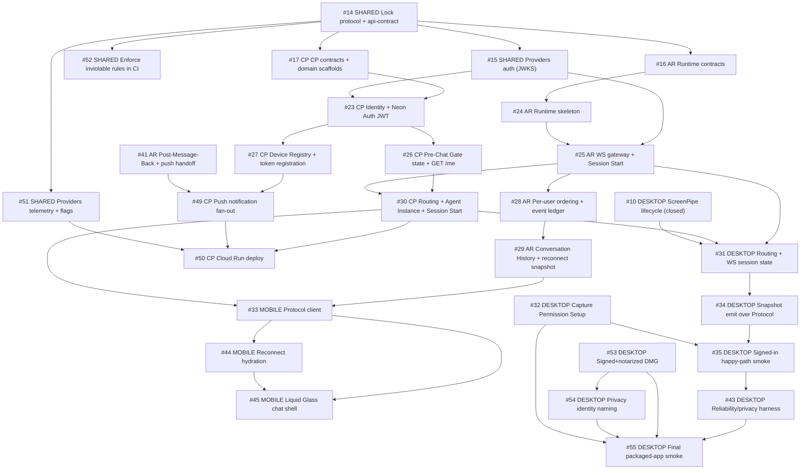

# Issue Board

> Issue numbers are GitHub issue numbers. Click Issue titles to open on GitHub.

## Operating Frame

- Date: 2026-06-06
- Repo: Intentive monorepo (`sruj75/Intentive`)
- Tracker root: [GitHub Issues](https://github.com/sruj75/Intentive/issues) on `sruj75/Intentive` (v1 backlog #7–#56); PRDs at `[docs/prd/](prd/)`
- Closed: `#7`–`#23` — Desktop v1 foundation (`#7`–`#13`), shared protocol/api-contract + Providers auth (`#14`–`#15`), AR/CP contract roots (`#16`–`#17`, [PR #57](https://github.com/sruj75/Intentive/pull/57)), Mobile foundation lane (`#18`–`#22`, [PR #57](https://github.com/sruj75/Intentive/pull/57), [PR #58](https://github.com/sruj75/Intentive/pull/58)), CP Identity + mobile launch hydration (`#23`, commit `8e65c71`)
- Open: `#24`–`#56`

## Executive Next Move

Two shared roots are now landed (`#14` protocol/api-contract lock, `#15` Providers JWKS auth). Runtime and CP contract roots ([#16](https://github.com/sruj75/Intentive/issues/16), [#17](https://github.com/sruj75/Intentive/issues/17)), the Mobile foundation lane (`#18`–`#22`), and [#23 CP Identity](https://github.com/sruj75/Intentive/issues/23) are **closed** (`8e65c71`: `GET /me`, `control_plane.users`, mobile `LaunchStateSource` wiring, `control-plane-ci.yml`). **Now:** [#25 AR WS gateway](https://github.com/sruj75/Intentive/issues/25) on the runtime critical path; [#26 CP Pre-Chat Gate state](https://github.com/sruj75/Intentive/issues/26) and [#27 CP Device Registry](https://github.com/sruj75/Intentive/issues/27) on the CP lane (both unblocked by `#23`).

What it unlocks:

- `#15` (Providers auth) → `#51` (telemetry/flags) → `#52` (CI rule enforcement).
- `#16` → `#24` → `#25` → `#28` → `#29` critical path (runtime lane roots landed).
- `#17` → `#23` → `#26`/`#27` → `#30` (Routing + Session Start) → `#49` (push).
- Mobile **Protocol + reconnect-snapshot** slices (`#33` onward) once `#29` + `#30` land; local gates and chat primitive boundary are done (`#18`–`#22`).
- Desktop Routing/Protocol session and snapshot emit slices.

## Dependency Map

## Sequenced Backlog

### Phase 0: Closed (shipped)

| #   | Deployable    | Issue                                                                                                          | Status                                                           |
| --- | ------------- | -------------------------------------------------------------------------------------------------------------- | ---------------------------------------------------------------- |
| 7   | Desktop       | [Lock v1 model and Agent Interface contract](https://github.com/sruj75/Intentive/issues/7)                     | closed                                                           |
| 8   | Desktop       | [Replace starter scaffold with Intentive menu bar shell](https://github.com/sruj75/Intentive/issues/8)         | closed                                                           |
| 9   | Desktop       | [Add minimal Settings account shell](https://github.com/sruj75/Intentive/issues/9)                             | closed                                                           |
| 10  | Desktop       | [Manage ScreenPipe Capture Session lifecycle end to end](https://github.com/sruj75/Intentive/issues/10)        | closed                                                           |
| 11  | Desktop       | [Establish local snapshot store with retention](https://github.com/sruj75/Intentive/issues/11)                 | closed                                                           |
| 12  | Desktop       | [Manage Ollama readiness and first-run setup](https://github.com/sruj75/Intentive/issues/12)                   | closed                                                           |
| 13  | Desktop       | [Produce a Context Snapshot on fixed 10-minute heartbeat cycle](https://github.com/sruj75/Intentive/issues/13) | closed                                                           |
| 14  | Shared        | [Lock Protocol + API-Contract V1](https://github.com/sruj75/Intentive/issues/14)                               | closed                                                           |
| 15  | Shared        | [Providers auth (JWKS)](https://github.com/sruj75/Intentive/issues/15)                                         | closed                                                           |
| 16  | Agent Runtime | [Resolve Runtime Contracts](https://github.com/sruj75/Intentive/issues/16)                                     | closed                                                           |
| 17  | Control Plane | [CP Contracts + Domain Scaffolds](https://github.com/sruj75/Intentive/issues/17)                               | closed                                                           |
| 18  | Mobile        | [Scaffold Expo App + Launch State Resolver](https://github.com/sruj75/Intentive/issues/18)                     | closed ([PR #57](https://github.com/sruj75/Intentive/pull/57))   |
| 19  | Mobile        | [Identity Gate](https://github.com/sruj75/Intentive/issues/19)                                                 | closed ([PR #58](https://github.com/sruj75/Intentive/pull/58))   |
| 20  | Mobile        | [Consent Primer](https://github.com/sruj75/Intentive/issues/20)                                                | closed ([PR #58](https://github.com/sruj75/Intentive/pull/58))   |
| 21  | Mobile        | [Sibling Client Invitation (macOS Setup)](https://github.com/sruj75/Intentive/issues/21)                       | closed ([PR #58](https://github.com/sruj75/Intentive/pull/58))   |
| 22  | Mobile        | [assistant-ui/native Spike](https://github.com/sruj75/Intentive/issues/22)                                     | closed ([PR #58](https://github.com/sruj75/Intentive/pull/58))   |
| 23  | Control Plane | [Identity + Neon Auth JWT](https://github.com/sruj75/Intentive/issues/23)                                      | closed (`8e65c71`) — `GET /me`, users repo, mobile launch source |

### Phase 1: Now

| #   | Deployable    | Issue                                                                                 | Why now                                      | Unblocks      |
| --- | ------------- | ------------------------------------------------------------------------------------- | -------------------------------------------- | ------------- |
| 24  | Agent Runtime | [Runtime Skeleton](https://github.com/sruj75/Intentive/issues/24)                     | Establishes module seams before behavior     | #25           |
| 25  | Agent Runtime | [WS Gateway + Session Start](https://github.com/sruj75/Intentive/issues/25)           | First working handshake path for all clients | #28; #30; #31 |
| 26  | Control Plane | [Pre-Chat Gate state + GET /me](https://github.com/sruj75/Intentive/issues/26)        | `#23` landed identity slice; gate truth next | #30           |
| 27  | Control Plane | [Device Registry + token registration](https://github.com/sruj75/Intentive/issues/27) | `#23` landed; device rows next               | #49           |

### Phase 2: Next

| #   | Deployable    | Issue                                                                                      | Blocker cleared by               | Unblocks                    |
| --- | ------------- | ------------------------------------------------------------------------------------------ | -------------------------------- | --------------------------- |
| 28  | Agent Runtime | [Sessions / Ordering / Event Ledger](https://github.com/sruj75/Intentive/issues/28)        | #25                              | #29                         |
| 29  | Agent Runtime | [Conversation History + Reconnect Snapshot](https://github.com/sruj75/Intentive/issues/29) | #28                              | #33/#44; #36/#39/#41        |
| 30  | Control Plane | [Routing + Agent Instance + Session Start](https://github.com/sruj75/Intentive/issues/30)  | #26 + #25                        | #33; #31 (keystone Routing) |
| 31  | Desktop       | [Routing + Protocol WS Session](https://github.com/sruj75/Intentive/issues/31)             | #25 + #30                        | #34/#35/#43                 |
| 32  | Desktop       | [Capture Permission Setup](https://github.com/sruj75/Intentive/issues/32)                  | none (start now)                 | #35/#55                     |
| 33  | Mobile        | [Protocol client for Companion Chat](https://github.com/sruj75/Intentive/issues/33)        | #29 + #30 Routing                | #44/#45                     |
| 34  | Desktop       | [Emit Context Snapshots over Protocol](https://github.com/sruj75/Intentive/issues/34)      | #31 + existing snapshot pipeline | #35/#43                     |
| 35  | Desktop       | [Signed-in happy-path smoke](https://github.com/sruj75/Intentive/issues/35)                | #34 + #32                        | #43/#55 confidence          |

### Phase 3: Later

| #   | Deployable         | Issue                                                                                          | Wait reason                               | Notes                                                      |
| --- | ------------------ | ---------------------------------------------------------------------------------------------- | ----------------------------------------- | ---------------------------------------------------------- |
| 36  | Agent Runtime      | [DeepAgents integration](https://github.com/sruj75/Intentive/issues/36)                        | #29                                       | Start once reconnect snapshot path is stable               |
| 37  | Agent Runtime      | [VFS / Bundles / Memory](https://github.com/sruj75/Intentive/issues/37)                        | #36                                       | Gates #38 and #42                                          |
| 38  | Agent Runtime      | [Context Snapshots + Session End Markers](https://github.com/sruj75/Intentive/issues/38)       | #37                                       | Required for #40                                           |
| 39  | Agent Runtime      | [Cron](https://github.com/sruj75/Intentive/issues/39)                                          | #29                                       | Parallel with #41 after #29                                |
| 40  | Agent Runtime      | [Heartbeat](https://github.com/sruj75/Intentive/issues/40)                                     | #38                                       | Periodic trigger lane                                      |
| 41  | Agent Runtime      | [Post-Message-Back + push handoff](https://github.com/sruj75/Intentive/issues/41)              | #29                                       | Control Plane push handoff dependency                      |
| 42  | Agent Runtime      | [Observability / safety / prod readiness](https://github.com/sruj75/Intentive/issues/42)       | #37/#39/#40/#41                           | Runtime release hardening gate                             |
| 43  | Desktop            | [Reliability + privacy verification harness](https://github.com/sruj75/Intentive/issues/43)    | #34/#35                                   | Privacy/reliability verification gate                      |
| 44  | Mobile             | [Reconnect hydration](https://github.com/sruj75/Intentive/issues/44)                           | #33 + #29                                 | Server-truth conversation behavior                         |
| 45  | Mobile             | [Liquid Glass chat shell + Floating Composer](https://github.com/sruj75/Intentive/issues/45)   | #33/#44                                   | First full chat experience                                 |
| 46  | Mobile             | [Account Surface](https://github.com/sruj75/Intentive/issues/46)                               | #21/#45                                   | Setup recovery + status surface                            |
| 47  | Mobile             | [Continuity / Agent State / Capability-Honesty](https://github.com/sruj75/Intentive/issues/47) | #44/#45/#46                               | Capability-honesty polish                                  |
| 48  | Mobile             | [E2E verification + visual polish pass](https://github.com/sruj75/Intentive/issues/48)         | most prior mobile slices                  | Final mobile release confidence                            |
| 49  | Control Plane      | [Push notification fan-out](https://github.com/sruj75/Intentive/issues/49)                     | #27 + #41                                 | Completes Post-Message-Back → APNs path                    |
| 50  | Control Plane      | [Cloud Run deploy + prod readiness](https://github.com/sruj75/Intentive/issues/50)             | #30/#49/#51                               | Re-enables skipped deploy workflow; production CP          |
| 51  | Shared             | [Providers telemetry + feature flags](https://github.com/sruj75/Intentive/issues/51)           | #14                                       | Observability for #50 and #42                              |
| 52  | Shared             | [Enforce inviolable rules in CI](https://github.com/sruj75/Intentive/issues/52)                | #14                                       | Keeps layer/boundary/vocabulary/version rules from rotting |
| 53  | Desktop            | [Signed + notarized DMG](https://github.com/sruj75/Intentive/issues/53)                        | Human signing credentials                 | Can run in parallel with runtime lane                      |
| 54  | Desktop            | [macOS Privacy Settings identity](https://github.com/sruj75/Intentive/issues/54)               | #53                                       | Required for #55                                           |
| 55  | Desktop            | [Final packaged-app release smoke](https://github.com/sruj75/Intentive/issues/55)              | #43/#53/#54/#32                           | Release bar                                                |
| 56  | Desktop (optional) | [In-app updates (check / notify / install)](https://github.com/sruj75/Intentive/issues/56)     | Not on core capture-runtime critical path | Improves post-launch operability                           |

## Blocked / Waiting

| Issue                                            | Waiting on                                   | Evidence                                               | Next check                                                |
| ------------------------------------------------ | -------------------------------------------- | ------------------------------------------------------ | --------------------------------------------------------- |
| #53 Desktop — Signed/notarized DMG               | Human Apple signing/notarization credentials | Issue notes explicit human credential dependency       | Confirm credential readiness before packaging pass        |
| #55 Desktop — Final packaged-app smoke           | #43, #53, #54, #32                           | Explicit `Blocked by` chain in issue                   | Re-evaluate once #43 and packaging pass exist             |
| #42 Agent Runtime — Observability/prod readiness | #37, #39, #40, #41                           | Explicit `Blocked by` chain in issue                   | Re-plan hardening sprint after trigger + push slices land |
| #48 Mobile — E2E verification                    | Most mobile stack                            | Explicit broad blocker list including core chat slices | Treat as terminal verification gate only                  |

## Per-Deployable Status

### Shared / Cross-Cutting (issues #14–#15, #51–#52)

- `#14` (protocol/api-contract lock) and `#15` (Providers JWKS auth) are **closed**.
- **Next:** `#51` (telemetry/flags) and `#52` (CI rules) only depend on `#14`; run them while other lanes progress.
- `packages/providers/src/auth.ts` now ships a real `jose`-backed `createJwtVerifier` (see `packages/providers/test/auth.test.mjs`); `#23` (closed) and `#25` consume it from `@intentive/providers/auth`.

### Mobile Client (issues #18–#22 closed; #33, #44–#48 open)

- Foundation lane **closed** (`#18`–`#22`): Expo scaffold + launch resolver ([PR #57](https://github.com/sruj75/Intentive/pull/57)); Identity Gate, Consent Primer, Sibling Invitation, CompanionChat / assistant-ui spike ([PR #58](https://github.com/sruj75/Intentive/pull/58)).
- `#23` slice on mobile (`8e65c71`): `createControlPlaneLaunchStateSource` + `mapAccountStateToLaunchState` wired at boot; `EXPO_PUBLIC_CONTROL_PLANE_BASE_URL`. Remainder (real Neon OAuth redirect, cold-launch restore with live session) tracks follow-on issues.
- **Next:** `#33` (Protocol client) once `#29` (AR Conversation History) and `#30` (CP Routing) land; then `#44`–`#48` chat and release slices.
- Cross-project dependency: Protocol/chat slices rely on AR `#25`–`#29` and CP Routing `#30`.

### Desktop Client (issues #7–#13 closed; #31–#32, #34–#35, #43, #53–#56 open)

- `#7`–`#13` closed.
- **Next:** `#31` (Routing + Protocol WS Session) once AR `#25` and CP `#30` land. `#32` (Capture Permission Setup) can start immediately.
- Snapshot emit (`#34`) and signed-in smoke (`#35`) follow `#31`.
- Cross-project dependency: Snapshot emit and signed-in smoke need AR gateway semantics and protocol compatibility.

### Control Plane (issues #17, #23 closed; #26–#27, #30, #49–#50 open)

- `#17` (CP Contracts + Domain Scaffolds) **closed** ([PR #57](https://github.com/sruj75/Intentive/pull/57)).
- `#23` (Identity + Neon Auth JWT) **closed** (`8e65c71`): identity domain (`GET /me`, users repo, `migrations/0001_users.sql`), PR CI (`.github/workflows/control-plane-ci.yml`), ADR-0003 repo integration tests. `next_gate` / `has_agent_instance` remain placeholders until `#26` / `#30`.
- **Next:** `#26` (gate state shaping on `GET /me`) and `#27` (Device Registry) in parallel.
- **Keystone:** `#30` (Routing + Session Start) unblocks Mobile `#33` and Desktop `#31` — it pairs with AR `#25`.
- Cross-project dependency: depends on `#14` (api-contract lock) and `#15` (Providers auth); calls AR `POST /internal/sessions/start` and receives `POST /internal/notifications/push`.

### Agent Runtime (issues #16 closed; #24–#25, #28–#29, #36–#42 open)

- `#16` (Resolve Runtime Contracts) **closed** ([PR #57](https://github.com/sruj75/Intentive/pull/57)). Remaining runtime behavior chain open.
- **Next:** `#24` → `#25` on the critical path.
- Cross-project dependency: `#25` (WS gateway) is on the critical path for mobile conversation continuity and desktop snapshot delivery.

## Source Index

- PRDs:
  - [shared-contracts-PRD.md](prd/shared-contracts-PRD.md)
  - [mobile-PRD.md](prd/mobile-PRD.md)
  - [desktop-PRD.md](prd/desktop-PRD.md)
  - [control-plane-PRD.md](prd/control-plane-PRD.md)
  - [agent-runtime-PRD.md](prd/agent-runtime-PRD.md)
- Issues: [GitHub #7–#56](https://github.com/sruj75/Intentive/issues)
