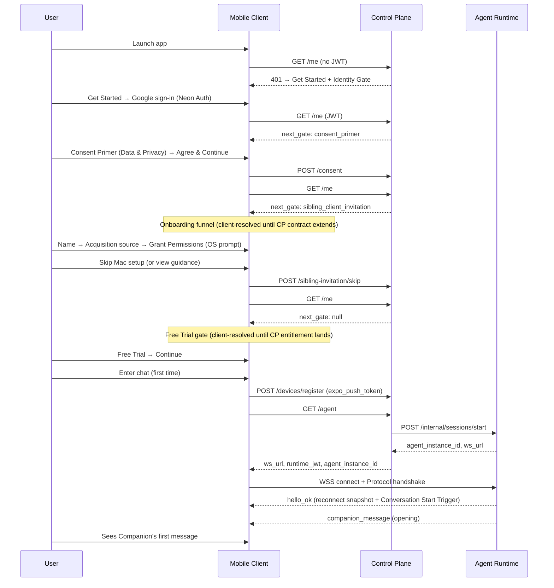
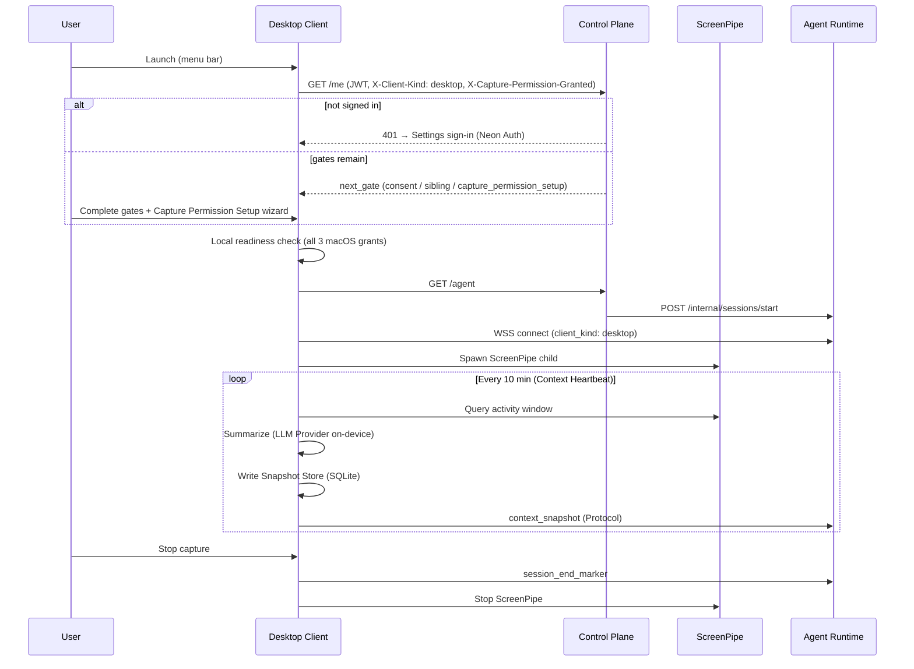
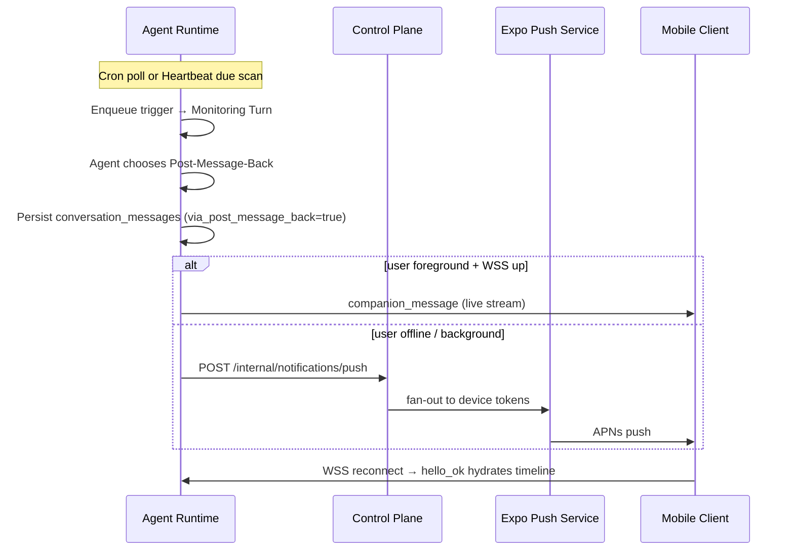

# User Journey Map

How Intentive's four deployables and shared packages connect to the journeys users actually take. For vocabulary, see [`CONTEXT-MAP.md`](../CONTEXT-MAP.md). For deployment topology, see [`PRODUCTION.md`](PRODUCTION.md). For layer rules and invariants, see [`ARCHITECTURE.md`](../ARCHITECTURE.md).

## Deployables at a glance

| Deployable         | Path                      | What the user experiences                                                                 | Where it runs                               |
| ------------------ | ------------------------- | ----------------------------------------------------------------------------------------- | ------------------------------------------- |
| **Mobile Client**  | `apps/mobile/`            | Sign-in, Pre-Chat Gates, **Companion Chat**, push notifications, Account Surface          | iOS (Expo) → TestFlight / App Store         |
| **Desktop Client** | `apps/desktop/`           | Menu-bar capture agent, macOS permission setup, on-device summarization, context delivery | macOS Tauri (Apple Silicon) → signed `.dmg` |
| **Control Plane**  | `services/control-plane/` | Invisible authority: identity, gate state, device registry, Routing, push fan-out         | Cloud Run (`us-west1`)                      |
| **Agent Runtime**  | `services/agent-runtime/` | The **Companion**: chat, memory, proactive follow-ups, context from Mac                   | GCE VM (`runtime.heyintentive.com`)         |

**Shared contracts** (`packages/`): `protocol/` (WebSocket), `api-contract/` (Control Plane HTTP), `domain-types/`, `boundary/`, `providers/` (auth, telemetry). Clients never import server source; servers never redefine wire shapes locally.

```text
                         ┌─────────────────────────────────┐
                         │         Neon Postgres           │
                         │  control_plane.*  agent_runtime.* │
                         └──────────┬──────────────┬───────┘
                                    │              │
              ┌─────────────────────▼──┐    ┌──────▼──────────────────┐
              │     Control Plane      │    │     Agent Runtime       │
              │  identity · gates ·      │    │  gateway · sessions ·   │
              │  devices · routing ·     │◄──►│  conversation · cron ·  │
              │  notifications           │    │  heartbeat · delivery   │
              └──────────┬───────────────┘    └──────────┬──────────────┘
                         │  GET /me, /agent               │  WSS /ws
                         │  POST /consent, /devices       │  Protocol events
              ┌──────────┴──────────────┬─────────────────┴──────────┐
              │                         │                            │
        ┌─────▼─────┐            ┌──────▼──────┐              (future)
        │  Mobile   │            │   Desktop   │              Android
        │  (chat)   │            │  (capture)  │
        └───────────┘            └─────────────┘
```

**Data-path rule:** Control Plane issues **Routing** once (`GET /agent` → `ws_url` + `runtime_jwt`) and steps out. All in-session traffic is Client ↔ Agent Runtime over WebSocket **Protocol**. Control Plane never proxies messages.

---

## Journey index

| #   | Journey                                                                           | Primary deployables                   |
| --- | --------------------------------------------------------------------------------- | ------------------------------------- |
| 1   | [Cold launch → first chat (Mobile)](#1-cold-launch-first-chat-mobile)             | Mobile, Control Plane, Agent Runtime  |
| 2   | [Returning Mobile user](#2-returning-mobile-user)                                 | Mobile, Control Plane, Agent Runtime  |
| 3   | [Cold launch → capture (Desktop)](#3-cold-launch-capture-desktop)                 | Desktop, Control Plane, Agent Runtime |
| 4   | [Cross-client: iPhone first, Mac second](#4-cross-client-iphone-first-mac-second) | All four                              |
| 5   | [Send a chat message](#5-send-a-chat-message)                                     | Mobile, Agent Runtime                 |
| 6   | [Mac context reaches the Companion](#6-mac-context-reaches-the-companion)         | Desktop, Agent Runtime                |
| 7   | [Proactive Companion + push](#7-proactive-companion-push)                         | Agent Runtime, Control Plane, Mobile  |
| 8   | [Account recovery & sibling setup](#8-account-recovery-sibling-setup)             | Mobile, Control Plane                 |

---

## 1. Cold launch → first chat (Mobile)

**User story:** Opens Intentive for the first time, sees Get Started, signs in with Google, accepts Data & Privacy, completes the onboarding funnel (name, acquisition source, notification permission), optionally skips Mac setup, accepts the free-trial offer, enters Companion Chat, receives the runtime-generated opening message.

### Flow



### Gate sequence

**Mobile Launch State Resolver** (client-owned ordering; see `apps/mobile/docs/adr/0019-*`):

`SIGNED_OUT` → `MISSING_CONSENT` → `MISSING_ONBOARDING` → `SIBLING_INVITATION_PENDING` → `MISSING_TRIAL` → `READY_FOR_CHAT`

**Control Plane `next_gate`** (cross-client durable gates in `services/control-plane/src/domains/gates/service/compute-next-gate.ts`):

1. **Identity Gate** — satisfied by JWT on `GET /me` (not returned as `next_gate`)
2. **Consent Primer** — `POST /consent` (cross-client)
3. **Sibling Client Invitation** — `POST /sibling-invitation/skip` or observed Desktop device (cross-client)
4. **Capture Permission Setup** — Desktop only; Mobile never sees it

**Onboarding** (name → acquisition source → grant permissions) and **Free Trial** are client-resolved Pre-Chat Gates today. The Mobile mapper marks both `completed` for every real `GET /me` response until `packages/api-contract` and Control Plane gate sequencing extend; stub `LaunchStateSource` dev scenarios exercise the screens locally.

### Code map

| Step                    | Mobile Client                                                                                                                    | Control Plane                                                                         | Agent Runtime                                                                    |
| ----------------------- | -------------------------------------------------------------------------------------------------------------------------------- | ------------------------------------------------------------------------------------- | -------------------------------------------------------------------------------- |
| Launch routing          | `app/_layout.tsx` → `resolveLaunchState` (`src/domains/onboarding/service/resolve-launch-state.ts`) → `route-for-destination.ts` | —                                                                                     | —                                                                                |
| Account / gate read     | `createControlPlaneLaunchStateSource` (`src/providers/launch-state/`) maps `GET /me` → `LaunchState`                             | `identity/ui/get-me.ts` → `resolveAccount` composes `next_gate`, `has_desktop_client` | —                                                                                |
| Get Started             | `src/domains/auth/ui/get-started.tsx` (first view inside `/(gates)/identity`; not a gate)                                          | —                                                                                     | —                                                                                |
| Identity Gate           | `src/domains/auth/ui/` + Neon Auth via `Auth Adapter`                                                                            | JWT verify: `src/http/auth.ts` + `packages/providers/` JWKS                           | —                                                                                |
| Consent Primer          | `app/(gates)/consent.tsx` → `onboarding/ui/consent-primer.tsx` (Data & Privacy)                                                  | `gates/ui/post-consent.ts` → `control_plane.user_gates`                               | —                                                                                |
| Onboarding funnel       | `app/(onboarding)/index.tsx` → `onboarding/ui/onboarding-funnel.tsx` (name → source → grant permissions)                         | — (client-resolved until CP contract extends)                                         | —                                                                                |
| Sibling invitation      | `app/(gates)/invite.tsx`                                                                                                         | `gates/ui/post-sibling-invitation-skip.ts`                                            | —                                                                                |
| Free Trial              | `app/(gates)/trial.tsx` → `onboarding/ui/free-trial.tsx`                                                                           | — (client-resolved until CP entitlement lands)                                        | —                                                                                |
| Notification permission | `onboarding/ui/grant-permissions.tsx` (injected ask via `(onboarding)` route)                                                    | —                                                                                     | —                                                                                |
| Device + push token     | `notifications/` → `POST /devices/register` (around first chat entry; no re-prompt once decided)                                | `devices/ui/post-device-register.ts` → `control_plane.devices`                        | —                                                                                |
| Routing                 | `chat/service/routing-client.ts` → `GET /agent`                                                                                  | `routing/ui/get-agent.ts` → `agents.ensureAgentInstance` → Session Start              | `internal/` receives `POST /internal/sessions/start`                             |
| Chat surface            | `src/entrypoints/chat-entry.tsx` → `CompanionChat` + Runtime Adapter                                                             | —                                                                                     | `gateway/` handshake, `sessions/` per-user queue                                 |
| Opening message         | Runtime Adapter merges `hello_ok` snapshot                                                                                       | —                                                                                     | Session Start bundles **Conversation Start Trigger**; `runtime/` runs first turn |

**Wire contracts:** `packages/api-contract/` (`GetMeResponse`, `PostConsentRequest`, `GetAgentResponse`); `packages/protocol/` (`connect`, `hello_ok`, `companion_message`, `user_message`).

---

## 2. Returning Mobile user

**User story:** Reopens app; lands directly in chat if gates are clear; timeline survives reinstall because history is server-truth.

### Flow

```text
Launch → GET /me → next_gate: null → route to (chat)/
       → GET /agent → WSS reconnect
       → hello_ok snapshot hydrates Message Store
       → live companion_message / presence_update append
```

### Code map

| Concern           | Mobile Client                                                                                                           | Control Plane              | Agent Runtime                                                    |
| ----------------- | ----------------------------------------------------------------------------------------------------------------------- | -------------------------- | ---------------------------------------------------------------- |
| Skip gates        | `resolveLaunchState` → `READY_FOR_CHAT` when consent + onboarding + sibling + trial are satisfied                     | `computeNextGate` → `null` (shared gates only; onboarding/trial are client-resolved today) | —                                                                |
| History hydration | `runtime/runtime-adapter.ts` + `service/conversation-reducer.ts` + `service/message-store.ts` (in-memory only; no disk) | —                          | `conversation/` + `hello_ok` / `session_snapshot` in `protocol/` |
| Reconnect         | Runtime Adapter: generation tokens, queue until `hello_ok`, merge backfill                                              | —                          | `gateway/runtime/connection-registry.ts`, `sessions/` ordering   |
| Agent State UI    | `service/chat-presentation.ts` (`Available` / `Thinking` / `Following up` / `Paused`)                                   | —                          | `via_post_message_back` flag on messages                         |

---

## 3. Cold launch → capture (Desktop)

**User story:** Installs Mac app, signs in, grants Screen Recording / Accessibility / Microphone, capture starts automatically, menu bar shows status.

### Flow



### Gate sequence (Desktop)

Same Control Plane sequencer; Desktop additionally requires **Capture Permission Setup** until `X-Capture-Permission-Granted: true` on `GET /me`. Live three-grant readiness is enforced locally in Rust (interlock authority); Control Plane gate is the coarser policy nudge (Screen Recording signal only).

### Code map

| Step               | Desktop Client                                                                  | Control Plane                                | Agent Runtime                                              |
| ------------------ | ------------------------------------------------------------------------------- | -------------------------------------------- | ---------------------------------------------------------- |
| Sign-in UI         | `src/domains/auth/` (Neon Auth); token handed to Rust, not Routing              | —                                            | —                                                          |
| Permission wizard  | `src/domains/onboarding/ui/CapturePermissionSetup.tsx`                          | `GET /me` with device signal headers         | —                                                          |
| Gate reads         | Rust `routing/` uses Control Plane HTTP after login token set                   | Same `identity` + `gates` composer as Mobile | —                                                          |
| Routing + WSS      | `src-tauri/src/domains/routing/runtime/` (`WsSession`)                          | `GET /agent`                                 | `gateway/`                                                 |
| Capture lifecycle  | `capture/runtime/coordinator/`, `screenpipe_supervisor/`                        | —                                            | —                                                          |
| Permission monitor | `capture/runtime/permission_monitor/`, `providers/permissions/`                 | —                                            | —                                                          |
| Summarization      | `summarization/service/` (Apple Intelligence → Ollama tiers)                    | —                                            | —                                                          |
| Local persistence  | `snapshots/repo/` (`SnapshotStore`, `intentive.db`)                             | —                                            | —                                                          |
| Context delivery   | `snapshots/runtime/heartbeat/` → `WsSessionAgentSink` in `lib.rs`               | —                                            | `protocol/` ingress → **Sensory Buffer** → Monitoring Turn |
| Menu bar UX        | `menubar/ui/`, `menubar/service/`                                               | —                                            | —                                                          |
| Session end        | Heartbeat `stop()` emits `session_end_marker` before ScreenPipe stop (ADR-0022) | —                                            | `sessions/` event ledger                                   |

**Desktop has no chat UI in v1.** WebSocket carries `context_snapshot`, `session_end_marker`, and delivery acks only.

---

## 4. Cross-client: iPhone first, Mac second

**User story:** Onboards on iPhone, chats with Companion, later installs Mac app — Mac skips Identity and Consent, must complete Capture Permission Setup locally, then feeds context into the same Agent Instance.

### What transfers vs what doesn't

| State                | Cross-client?         | Mechanism                                                                   |
| -------------------- | --------------------- | --------------------------------------------------------------------------- |
| Identity (sign-in)   | Yes                   | Neon Auth JWT; same `user_id`                                               |
| Consent Primer       | Yes                   | `control_plane.user_gates` via `POST /consent`                              |
| Sibling invitation   | Yes                   | Skip record **or** observed Desktop in Device Registry clears Mobile prompt |
| Capture permission   | **No** (device-local) | Mac wizard + live grant probes; `capture_permission_setup` gate             |
| Conversation History | Yes                   | One **Agent Instance** per User in Runtime                                  |
| Context Snapshots    | N/A on phone          | Desktop-only production                                                     |

### Code map

| Concern                         | Where it lives                                                                               |
| ------------------------------- | -------------------------------------------------------------------------------------------- |
| `has_desktop_client` on account | Control Plane `identity.resolveAccount` reads `devices.listDevicesForUser`                   |
| Sibling gate auto-clear         | `computeNextGate`: `hasSiblingDevice` from device registry                                   |
| Mac setup banner in chat        | Mobile `chat/service/chat-presentation.ts` reads projected `AccountState.has_desktop_client` |
| Same Companion                  | Both clients: same `user_id` → same `agent_instance_id` via `GET /agent` / Session Start     |

---

## 5. Send a chat message

**User story:** Types in Liquid Glass composer; sees streaming reply; failed sends can retry with same idempotency key.

### Flow

```text
User types → Runtime Adapter sends user_message (message_id, idempotency_key)
           → Agent Runtime: gateway → sessions (per-user queue) → runtime (Interactive Turn)
           → DeepAgents turn → companion_message chunks → delivery port (live stream)
           → Mobile Message Store merges stream + Delivery Status
```

### Code map

| Layer           | Path                                                                                     |
| --------------- | ---------------------------------------------------------------------------------------- |
| Composer UI     | `apps/mobile/src/domains/chat/ui/companion-chat.tsx`                                     |
| Protocol client | `apps/mobile/src/domains/chat/runtime/runtime-adapter.ts`                                |
| Wire schema     | `packages/protocol/` (`user_message`, `companion_message`, `delivery_ack`)               |
| Ingress         | `services/agent-runtime/src/domains/gateway/`                                            |
| Ordering        | `services/agent-runtime/src/domains/sessions/` (transactional ingress, idempotency keys) |
| Brain           | `services/agent-runtime/src/domains/runtime/service/turn-runner.ts` → DeepAgents adapter |
| History         | `services/agent-runtime/src/domains/conversation/` (Neon `conversation_messages`)        |
| Live delivery   | `services/agent-runtime/src/domains/delivery/service/delivery-port.ts`                   |

**Not in path:** Control Plane (no message proxy).

---

## 6. Mac context reaches the Companion

**User story:** While user works on Mac, Companion periodically "sees" summarized activity; when capture stops, Companion knows the session ended.

### Flow

```text
Context Heartbeat (10 min) → ScreenPipe window → on-device summary
                          → Snapshot Store insert (local-truth)
                          → context_snapshot on WSS
                          → Runtime event ledger → Sensory Buffer (latest perception)
                          → optional Monitoring Turn (silent unless Post-Message-Back)
```

Stop capture → `session_end_marker` → Sensory Buffer updated → agent can reason about liveness.

### Code map

| Step                | Desktop                        | Agent Runtime                                                                                           |
| ------------------- | ------------------------------ | ------------------------------------------------------------------------------------------------------- |
| Heartbeat tick      | `snapshots/runtime/heartbeat/` | —                                                                                                       |
| Protocol emit       | `lib.rs` `WsSessionAgentSink`  | `gateway/` → `sessions/`                                                                                |
| Persist event       | —                              | `runtime_events` ledger (ADR-0007)                                                                      |
| Latest context read | —                              | `sessions/repo/sensory-buffer.ts`                                                                       |
| Agent use           | —                              | `runtime/service/monitoring-turn.ts`, `bundles/service/assemble-system-prompt.ts` (`RECENT_PERCEPTION`) |

---

## 7. Proactive Companion + push

**User story:** Cron or Heartbeat fires while user is away; agent decides a message is worth sending; user gets a push notification (not for ordinary inline replies).

### Flow



### Invariants

- **Cron** and **Heartbeat** are triggers, not notifications.
- **Post-Message-Back** is the only path to push (Runtime → Control Plane → Expo).
- Ordinary reply to a user message does **not** push; it lands in the timeline only.

### Code map

| Concern                   | Agent Runtime                                       | Control Plane                                               | Mobile                                                               |
| ------------------------- | --------------------------------------------------- | ----------------------------------------------------------- | -------------------------------------------------------------------- |
| Cron                      | `domains/cron/` (poll loop, `/crons/` VFS cards)    | —                                                           | —                                                                    |
| Heartbeat                 | `domains/heartbeat/` (computed schedule, silent OK) | —                                                           | —                                                                    |
| Post-Message-Back         | `delivery/service/post-message-back.ts`             | —                                                           | —                                                                    |
| Push handoff              | Control Plane push client in `delivery-port.ts`     | `notifications/ui/post-internal-notifications-push.ts`      | —                                                                    |
| Token storage             | —                                                   | `devices/repo/devices.ts`                                   | `POST /devices/register`                                             |
| Receipt cleanup           | —                                                   | `POST /internal/notifications/check-receipts` (maintenance) | —                                                                    |
| Permission + registration | —                                                   | —                                                           | Grant Permissions in onboarding funnel; `POST /devices/register` around first chat entry |
| Continuity cue            | —                                                   | —                                                           | `chat-presentation.ts` (`Following up` from `via_post_message_back`) |

---

## 8. Account recovery & sibling setup

**User story:** Opens Account Surface from chat affordance; sees identity, connection mood, Mac setup status; can sign out or revisit Mac guidance without re-blocking gates.

### Code map

| Surface                     | Mobile                                                       | Control Plane             |
| --------------------------- | ------------------------------------------------------------ | ------------------------- |
| Account sheet               | `src/domains/account/ui/account-surface.tsx`                 | —                         |
| State source                | `src/providers/account-state/` → `GET /me` projection        | `identity.resolveAccount` |
| Connection status           | `account/service/account-status.ts` (Routing + runtime mood) | —                         |
| Sign out                    | `Auth Adapter.signOut` + `markSignedOut()` on Launch State   | —                         |
| Mac guidance (non-blocking) | `chat-presentation.ts` banner when `!has_desktop_client`     | Device registry           |

Desktop Settings (`src/domains/account/ui/AccountSettingsSurface.tsx`) shows coarse **Connection Mood** from Rust (`routing/types/connection_mood`) — no JWT or `ws_url` in the webview.

---

## Domain quick reference

Business domains per deployable (each follows `types → config → repo → service → runtime → ui`):

| Deployable     | Domains                                                                                                                        |
| -------------- | ------------------------------------------------------------------------------------------------------------------------------ |
| Mobile         | `auth`, `onboarding`, `chat`, `notifications`, `account`                                                                       |
| Desktop (TS)   | `auth`, `onboarding`, `account`                                                                                                |
| Desktop (Rust) | `capture`, `routing`, `snapshots`, `summarization`, `menubar`                                                                  |
| Control Plane  | `identity`, `devices`, `gates`, `agents`, `routing`, `notifications`                                                           |
| Agent Runtime  | `gateway`, `sessions`, `conversation`, `protocol`, `runtime`, `delivery`, `cron`, `heartbeat`, `memory`, `bundles`, `internal` |

---

## HTTP & Protocol cheat sheet

### Control Plane (public, JWT)

| Endpoint                        | Purpose                                               | Schema                            |
| ------------------------------- | ----------------------------------------------------- | --------------------------------- |
| `GET /me`                       | Account state + next Pre-Chat Gate                    | `packages/api-contract/public.ts` |
| `GET /agent`                    | Routing: `ws_url`, `runtime_jwt`, `agent_instance_id` | same                              |
| `POST /consent`                 | Record Consent Primer completion                      | same                              |
| `POST /sibling-invitation/skip` | Skip Mac setup prompt                                 | same                              |
| `POST /devices/register`        | Device fingerprint + Expo push token                  | same                              |

### Internal API (shared-secret)

| Direction     | Endpoint                                      | Purpose                               |
| ------------- | --------------------------------------------- | ------------------------------------- |
| CP → Runtime  | `POST /internal/sessions/start`               | Idempotent Agent Instance create/load |
| Runtime → CP  | `POST /internal/notifications/push`           | Post-Message-Back push handoff        |
| Operator → CP | `POST /internal/notifications/check-receipts` | Expo receipt maintenance              |

### Protocol (WSS, Neon Auth JWT on `connect`)

| Client → Runtime                                  | Runtime → Client                |
| ------------------------------------------------- | ------------------------------- |
| `connect` (+ `client_kind`, optional `client_tz`) | `hello_ok` (reconnect snapshot) |
| `user_message` (Mobile)                           | `companion_message`             |
| `context_snapshot` (Desktop)                      | `session_snapshot`              |
| `session_end_marker` (Desktop)                    | `history_backfill_response`     |
| `presence_update`, `delivery_ack`                 | `runtime_error`                 |
| `history_backfill_request`                        |                                 |

Full schemas: `packages/protocol/src/index.ts`.

---

## Related docs

| Topic                   | Document                                                                                                                                                                |
| ----------------------- | ----------------------------------------------------------------------------------------------------------------------------------------------------------------------- |
| Product vocabulary      | [`CONTEXT-MAP.md`](../CONTEXT-MAP.md)                                                                                                                                   |
| Mobile structure        | [`apps/mobile/ARCHITECTURE.md`](../apps/mobile/ARCHITECTURE.md)                                                                                                         |
| Desktop structure       | [`apps/desktop/ARCHITECTURE.md`](../apps/desktop/ARCHITECTURE.md)                                                                                                       |
| Control Plane structure | [`services/control-plane/ARCHITECTURE.md`](../services/control-plane/ARCHITECTURE.md)                                                                                   |
| Agent Runtime structure | [`services/agent-runtime/ARCHITECTURE.md`](../services/agent-runtime/ARCHITECTURE.md)                                                                                   |
| Wire contracts          | [`packages/api-contract/ARCHITECTURE.md`](../packages/api-contract/ARCHITECTURE.md), [`packages/CONTEXT.md`](../packages/CONTEXT.md)                                    |
| Production deploy       | [`PRODUCTION.md`](PRODUCTION.md)                                                                                                                                        |
| PRDs                    | [`docs/prd/mobile-PRD.md`](prd/mobile-PRD.md), [`docs/prd/control-plane-PRD.md`](prd/control-plane-PRD.md), [`docs/prd/agent-runtime-PRD.md`](prd/agent-runtime-PRD.md) |
